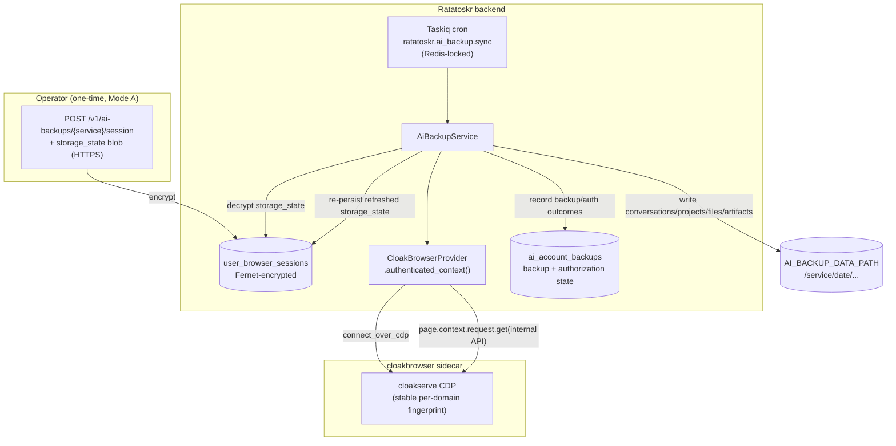

# AI Account Backup (ChatGPT + Claude) via CloakBrowser

How Ratatoskr will hold an authenticated session for the operator's own ChatGPT and Claude web accounts and periodically mirror everything they contain — conversations, Projects, project-knowledge files, attachments, and Claude Artifacts — to disk, reusing the CloakBrowser stealth sidecar that already ships in the scraper chain.

**Audience:** The operator deciding whether to run this, and contributors implementing it.
**Type:** Explanation + design (forward-looking).
**Status:** P0 + P1 implemented (config, model + migration, repository, Redis-locked Taskiq job + scheduler, REST status + session-ingest, Telegram surfaces, the authenticated CloakBrowser context, the ChatGPT + Claude internal-API clients, the path-safe on-disk writer, incremental skipping, and Mode A session ingest — all behind `AI_BACKUP_ENABLED=false`). The deterministic core is fully unit-tested with fakes/fixtures; the live cloakserve + real-account behavior (and ChatGPT Teams/Enterprise headers) is **not yet validated against live accounts** and is marked `TODO(live-validation)` in the clients. Tracked in [`docs/tasks/issues/ai-account-backup-cloakbrowser.md`](../tasks/issues/ai-account-backup-cloakbrowser.md).
**Related:** [`webwright.md`](webwright.md) (the `user_browser_sessions` encrypted-cookie pattern this reuses), [`scraper-chain.md`](scraper-chain.md) (where the CloakBrowser provider lives), [`git-mirroring.md`](git-mirroring.md) (the backup-subsystem template this mirrors), [`environment-variables.md`](../reference/environment-variables.md) (the planned `AI_BACKUP_*` surface), [`data-model.md`](../reference/data-model.md) (`user_browser_sessions`, planned `ai_account_backups`), [`../runbooks/ai-backup-live-validation.md`](../runbooks/ai-backup-live-validation.md) (how to validate against real accounts).
**Source (extends):** [`app/adapters/content/scraper/cloakbrowser_provider.py`](../../app/adapters/content/scraper/cloakbrowser_provider.py), [`app/db/models/webwright.py`](../../app/db/models/webwright.py) (`UserBrowserSession`), [`app/adapters/git_backup/`](../../app/adapters/git_backup/), [`app/tasks/git_backup_sync.py`](../../app/tasks/git_backup_sync.py), [`app/security/secret_crypto.py`](../../app/security/secret_crypto.py).

---

## Why this exists, and the honest caveat

The operator wants a durable, self-hosted backup of their entire ChatGPT and Claude history — not just the chat text that the providers' official ZIP exports give, but the structure those exports drop: ChatGPT Project grouping, Claude Projects with their knowledge files, uploaded attachments, and Claude Artifacts. None of that is recoverable from the sanctioned export for a consumer account.

This subsystem reaches it the only way left: it logs into the web product as the operator and reads the same internal APIs the web UI calls. That is a deliberate, eyes-open trade. **Driving these web products with automation violates both OpenAI's and Anthropic's Terms of Service**, and Anthropic has demonstrated zero-warning account suspension against exactly this class of session-token reuse (April 2026). Because the deployment is single-tenant and backs up the operator's *own* accounts with their own consent, the design minimizes the ban signal (real-login bootstrap, conservative cadence, no credential storage) rather than pretending the risk is zero. The subsystem ships **off by default** and is double-gated. An operator on Claude Enterprise should prefer the sanctioned Compliance API instead (see [Known gaps and escape hatches](#known-gaps-and-escape-hatches)).

The full landscape research behind this decision (official-export completeness, the OSS exporter inventory, the anti-bot benchmark, the ToS citations) is summarized in the task issue; this document is the design that follows from it.

## Where it sits

CloakBrowser is already integrated as a stealth-Chromium **sidecar** (`cloakhq/cloakbrowser`, `cloakserve` CDP mode at `http://cloakbrowser:9222`, driven through Playwright `connect_over_cdp`) under the `with-scrapers` Docker profile. Today the `CloakBrowserProvider` uses it **statelessly** — a fresh browser context per scrape, no persistent login. This subsystem adds the one thing that provider lacks: an **authenticated, persistent session** that survives across runs.



## Authentication and session model

The hard problem is not reading the APIs — it is establishing and keeping a session past 2FA and Cloudflare. Three bootstrap modes exist; the build targets **Mode A** and documents the others as future options.

- **Mode A — operator-supplied session (primary).** The operator logs into their normal browser, exports the relevant state as a Playwright `storage_state` JSON, and submits it once via `POST /v1/ai-backups/{service}/session` (HTTPS). ChatGPT needs `__Secure-next-auth.session-token` + `cf_clearance`; Claude needs `sessionKey` + `cf_clearance` + the organization UUID. A short documented DevTools snippet (or a tiny bookmarklet) produces the blob. **No account credentials are ever stored** — only the session blob, encrypted. This sidesteps headless login, login-page Turnstile, and 2FA entirely, and it is the lowest-ban-signal automatable path. Ingest is REST-only on purpose: the blob holds live cookies, so it must not transit Telegram's non-E2E chat (stored on Telegram servers, shown in notification previews). The Telegram surface is status-only (`/ai_backup`, `/ai_backups`).
- **Mode B — headful noVNC login (future).** Interactive human login into the cloakserve profile via CloakBrowser-Manager's noVNC viewer, snapshotting `context.storage_state()` afterward. Lowest ban signal of all (a real human login from the backup fingerprint and IP) but adds an early-alpha sidecar.
- **Mode C — automated credential login (explicit non-goal).** Storing email/password + a TOTP secret and logging in headlessly. Highest detection surface, most brittle, and the worst ban signal. Documented as out of scope.

**Session refresh, expiry, and revoke.** After every run the service calls `context.storage_state()` and re-encrypts/persists it, so rotating cookies keep the session alive longer. Expiry is detected from `401`, a redirect to `/auth/login`, or `403` with `cf-mitigated: challenge`; the service then sets `authorization_status=expired`, preserves the independent backup outcome, **halts** that service, and pings the operator to re-run Mode A. A newly ingested session stays `unverified` until the provider accepts it. The owner-only `DELETE /v1/ai-backups/{service}/session` endpoint idempotently deletes Ratatoskr's encrypted session and marks authorization `missing`; it does not remotely sign the account out at the provider. Halting (rather than retrying into a login wall) is itself a ban-avoidance measure.

## The `cf_clearance` durability decision

Cloudflare binds the `cf_clearance` cookie to the browser's TLS/JA3 fingerprint and source IP. A separate HTTP client (httpx) replaying the cookie with a different TLS signature gets re-challenged. Therefore **all internal-API GETs are issued from inside the authenticated CloakBrowser page context** via `page.context.request.get(...)` — the same `APIRequestContext` the existing provider already uses for gated PDF fetches (`_goto_capture`). This reuses the browser's cookie jar *and* its TLS fingerprint, keeping the clearance cookie valid. CloakBrowser derives its stealth fingerprint deterministically from the registrable domain, so `chatgpt.com` and `claude.ai` keep a stable fingerprint across the login snapshot and every subsequent backup run.

## Components and file map

| Concern | Path | Pattern it mirrors |
|---|---|---|
| Config | `app/config/ai_backup.py` (`AiBackupConfig`); attach to `AppConfig` in `app/config/settings.py` | `app/config/git_backup.py` |
| DB model | `app/db/models/ai_backup.py` (`AiAccountBackup`, `AiBackupService`, `AiBackupStatus`, `AI_BACKUP_MODELS`); register in `app/db/models/__init__.py` `ALL_MODELS` | `app/db/models/git_backup.py` |
| Migration | `app/db/alembic/versions/<rev>_add_ai_account_backups.py` (`alembic-migrations` skill) | git_mirrors migration |
| Provider | extend `CloakBrowserProvider` with `authenticated_context()` | its `_stealth_page()` ctx-mgr |
| Service + clients | `app/adapters/ai_backup/{service,chatgpt_client,claude_client,session_store,repository,errors}.py` | `app/adapters/git_backup/` |
| Taskiq task | `app/tasks/ai_backup_sync.py` (`ratatoskr.ai_backup.sync`, lock `task_lock:ai_backup_sync`) | `app/tasks/git_backup_sync.py` |
| Scheduler | `if cfg.ai_backup.enabled:` block in `app/tasks/scheduler.py::_build_tasks` | the `git_backup` block |
| REST | `app/api/routers/ai_backups.py`; regen OpenAPI | `app/api/routers/git_mirrors.py` |
| Telegram | `app/adapters/telegram/command_handlers/ai_backup_handler.py` (`/ai_backup`, `/ai_backups` — status only) | `git_mirror_handler.py` |

## Data model

The session blob reuses `UserBrowserSession` **with no migration** — `chatgpt.com` and `claude.ai` become new `domain` values, and the full Playwright `storage_state` JSON (cookies + localStorage) is stored in the existing Fernet `encrypted_cookies` column.

A new lifecycle table holds per-service run state, one row per `(user_id, service)`, modeled on `GitMirror`:

```python
class AiBackupService(enum.StrEnum):   # "chatgpt" | "claude"
class AiBackupStatus(enum.StrEnum):              # pending | ok | failed | disabled
class AiBackupAuthorizationStatus(enum.StrEnum): # missing | unverified | valid | expired

class AiAccountBackup(Base):
    __tablename__ = "ai_account_backups"
    __table_args__ = (UniqueConstraint("user_id", "service", name="uq_ai_account_backups_user_service"),)
    id, user_id (FK users.telegram_user_id, CASCADE), service, status
    authorization_status, authorization_checked_at
    last_backed_up_at, last_attempt_at, backoff_until
    consecutive_failures, total_failures, last_error, last_error_category
    counts_json (JSONB: conversations/projects/files/artifacts/bytes)
    last_backup_path, created_at, updated_at
```

`AiBackupRepository` carries a `WHERE user_id =` predicate on every read and write — the project's non-negotiable IDOR guard (Operating Rule 12), copied verbatim from `GitMirrorRepository`.

## Configuration surface

A frozen pydantic `AiBackupConfig` with `validation_alias` env vars, validators following `GitBackupConfig`:

`AI_BACKUP_ENABLED` (default `false`), `AI_BACKUP_SYNC_CRON` (`0 5 * * *`), `AI_BACKUP_DATA_PATH` (`/data/ai-backups`, with the same resolve-inside-data-path traversal guard git-backup uses), `AI_BACKUP_CHATGPT_ENABLED` / `AI_BACKUP_CLAUDE_ENABLED`, `AI_BACKUP_REQUEST_DELAY_MS` (cadence with jitter), `AI_BACKUP_MAX_REQUESTS_PER_RUN` (hard request cap), `AI_BACKUP_MAX_RESPONSE_BYTES` and `AI_BACKUP_MAX_RUN_BYTES` (per-response and aggregate transfer caps), `AI_BACKUP_MIN_FREE_BYTES` (reserved disk headroom), `AI_BACKUP_DOWNLOAD_FILES`, `AI_BACKUP_INCREMENTAL` (skip conversations whose `update_time` is unchanged since the last run), `AI_BACKUP_HOST_ALLOWLIST` (default `chatgpt.com,*.oaiusercontent.com,claude.ai,*.anthropic.com`), `AI_BACKUP_HC_PING_URL`, `AI_BACKUP_NOTIFY_CHAT_ID`, and `AI_BACKUP_NOTIFY_ON`. `AI_BACKUP_CLAUDE_COMPLIANCE_KEY` is reserved for a future sanctioned Enterprise client: setting it currently fails closed and never falls back to browser scraping. Crypto reuses `GITHUB_TOKEN_ENCRYPTION_KEY` — no new key surface.

## Internal APIs walked

All calls go through `page.context.request.get(...)` inside the authenticated context; every URL host is validated against `AI_BACKUP_HOST_ALLOWLIST` before the request.

**ChatGPT** (`access_token` read from `/api/auth/session`; `cf_clearance` already in the jar):

- `GET /backend-api/conversations?offset=&limit=100` — paginate the full list.
- `GET /backend-api/conversation/{id}` — full message tree (holds the Deep Research *report text*; structured citations are not here — a known gap).
- `GET /backend-api/gizmos/snorlax/sidebar` — Projects (the `snorlax` codename can change; a 404 is a soft-fail, not a run failure).
- `GET /backend-api/gizmos/{gizmo_id}/conversations?cursor=` — per-project conversations.
- `GET /backend-api/files/download/{file_id}` — attachments/images (gated by `AI_BACKUP_DOWNLOAD_FILES`).

**Claude** (`sessionKey` cookie + org UUID from `/api/bootstrap` or `/api/organizations`):

- `GET /api/organizations/{org}/chat_conversations` — list.
- `GET /api/organizations/{org}/chat_conversations/{uuid}?tree=True&rendering_mode=raw` — full conversation, Artifacts inline.
- `GET /api/organizations/{org}/projects` + project-docs endpoints — project knowledge (text; binaries via the project-files path).
- Artifacts: walk message arrays and persist artifact blocks as separate files.

## On-disk layout

```
AI_BACKUP_DATA_PATH/<service>/<YYYY-MM-DD>/
  conversations/<conversation_id>.json
  projects/<project_id>/{project.json, knowledge/<file>}
  files/<file_id>__<name>
  artifacts/<conversation_id>/<artifact_id>.<ext>   # Claude
  manifest.json   # counts, ids, content hashes, run metadata, correlation_id
```

Writes are idempotent by id; existing bytes are hash-checked, changed payloads are replaced atomically, and manifests always hash the bytes that were durably written. Repeated runs on the same UTC date merge the previous manifest entries before atomically publishing the new manifest; top-level `counts` describe the complete date directory while `run_metadata.collected_counts` describes only the latest sweep. `AI_BACKUP_INCREMENTAL` skips unchanged conversations. A run is successful only when every enabled collection subtree completes with the expected response shape; project or attachment failures fail the run instead of publishing a partial tree as `ok`. Session loading, writer creation, provider collection, manifest finalization, and success persistence share one lifecycle boundary, so local crypto or disk failures also persist a failed outcome. A later enhancement could `git commit` this tree through the existing git-backup engine for versioned history.

## Task, scheduler, and surfaces

The Taskiq task wraps its body in `RedisDistributedLock("task_lock:ai_backup_sync", ttl=1800)` with silent skip-if-held (copying the git-backup header), loops the enabled services, runs each, records the lifecycle row, fires the Healthchecks ping, and sends the Telegram notification. It records a fixed-cardinality `ratatoskr_backup_runs_total` outcome per provider and raises after all providers have been attempted when any state is not `ok`; therefore auth expiry, missing sessions, and partial provider failure cannot appear as generic Taskiq success. The scheduler gains one `if cfg.ai_backup.enabled:` block emitting a `ScheduledTask(task_name="ratatoskr.ai_backup.sync", cron=cfg.ai_backup.sync_cron, labels={"job": "ai_backup_sync"})`. REST exposes list / status plus owner-only session ingest and local revoke; Telegram exposes status-only `/ai_backup` and `/ai_backups` (session secrets remain REST/HTTPS-only).

## Security checklist

- `user_id` IDOR filter on every query; SSRF guard retained on navigations; host allowlist enforced on every internal-API URL; `AI_BACKUP_DATA_PATH` traversal validator reused from git-backup.
- Only the encrypted `storage_state` is persisted; `Authorization` / `Cookie` / `sessionKey` are redacted before logging; the session blob is never written into the backup tree.
- cloakserve digest pinned ≥ 0.3.28 (path-traversal fix `GHSA-mf33-gv72-w2h5`); the compose pin (0.3.30) already satisfies this. `CLOAKBROWSER_AUTO_UPDATE=false` stays (v148+ is Pro-licensed).
- Correlation IDs thread through the run for log and DB traceability.

## Known gaps and escape hatches

- **ChatGPT Deep Research structured citations** (the machine-readable `url_citation` objects and the reasoning trace) are not exposed by `/backend-api`; only the final report text is captured. They are reachable only via OpenAI's paid developer Responses API. Operator expectation must be set accordingly.
- **ChatGPT Custom GPT system prompts** are not confirmed retrievable via any internal endpoint.
- **Claude Enterprise** Compliance API support is not implemented. Setting `AI_BACKUP_CLAUDE_COMPLIANCE_KEY` makes the client factory fail closed; it never falls back to the consumer browser-scrape path. Keep Claude backup disabled until a dedicated sanctioned client is implemented.

## Phased delivery

1. **P0** — `AiAccountBackup` model + migration, `AiBackupConfig`, repository, task skeleton + scheduler block, REST/Telegram stubs. No scraping yet.
2. **P1/P2 (parallel)** — `authenticated_context()` plus both `ChatGPTBackupClient` and `ClaudeBackupClient` on the shared scaffolding, Mode A session ingest, on-disk writer, incremental skipping.
3. **P3** — auth-expiry detection + notify, Healthchecks, rate-cap + jitter, docs and env-reference rows, OpenAPI regen, tests.
4. **P4 (optional)** — Mode B noVNC login; git-versioned backup tree.

## Top risks

1. **Account suspension** — Anthropic enforced against this class in April 2026; the operator's own account is the collateral. Mode A's real-login bootstrap, conservative cadence, and halt-on-expiry minimize but do not eliminate the signal.
2. **Silent breakage** — internal endpoint names (`snorlax`) and Cloudflare detection change without notice; a scheduled run can fail with no clear signal until the lifecycle row flips to `failed`/`auth_expired`. Healthchecks + Telegram notify surface it promptly.
3. **CloakBrowser Pro gating** — staying on the free v146 binary is required unless a Pro subscription is budgeted; `CLOAKBROWSER_AUTO_UPDATE=false` prevents an accidental upgrade.
