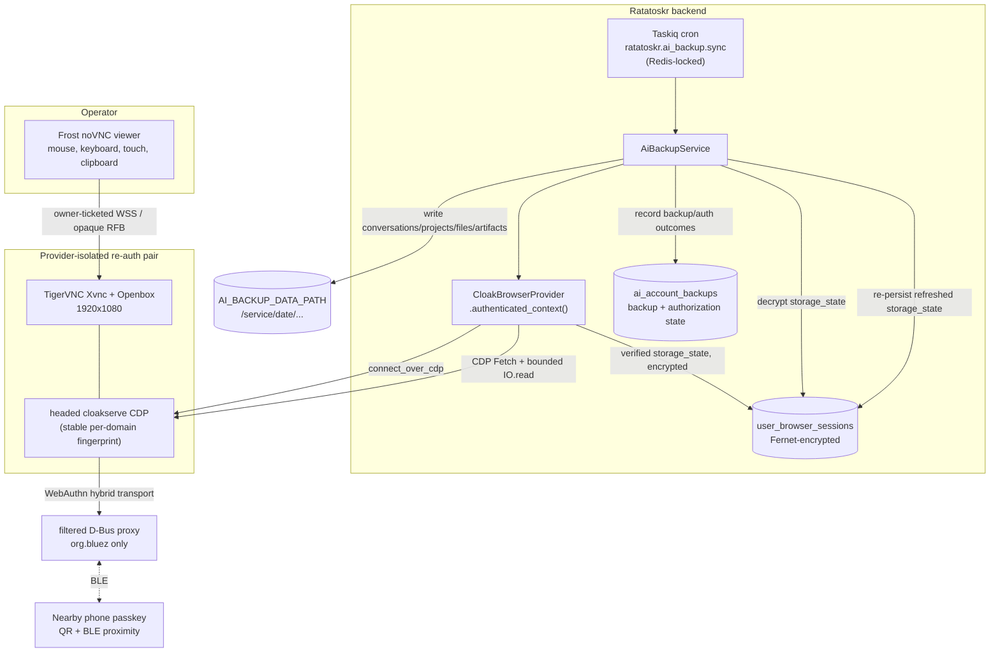

# AI Account Backup (ChatGPT + Claude) via CloakBrowser

How Ratatoskr holds an authenticated session for the operator's own ChatGPT and Claude web accounts and periodically mirrors conversations, Project metadata, ChatGPT attachments, and Claude Artifacts to disk. Background collection uses the existing CloakBrowser integration; interactive login uses provider-dedicated headed CloakBrowser/TigerVNC pairs. Project-knowledge download remains an explicitly unimplemented, live-contract-blocked target.

**Audience:** The operator deciding whether to run this, and contributors implementing it.
**Type:** Explanation + design (forward-looking).
**Status:** P0-P3 plus interactive re-authorization implemented (config, model + migration, repository, Redis-locked scheduled and targeted Taskiq jobs, REST status/session/re-auth surfaces, Telegram CTA, authenticated CloakBrowser context, ChatGPT + Claude clients, path-safe writer, and incremental skipping). Manual `storage_state` ingest remains an emergency fallback. The deterministic core is unit-tested with fakes/fixtures; provider internal APIs remain inherently subject to live contract drift. Claude project-knowledge downloads are not implemented. Tracked in [`docs/tasks/issues/ai-account-backup-cloakbrowser.md`](../tasks/issues/ai-account-backup-cloakbrowser.md).
**Related:** [`webwright.md`](webwright.md) (the `user_browser_sessions` encrypted-cookie pattern this reuses), [`scraper-chain.md`](scraper-chain.md) (where the CloakBrowser provider lives), [`git-mirroring.md`](git-mirroring.md) (the backup-subsystem template this mirrors), [`environment-variables.md`](../reference/environment-variables.md) (the planned `AI_BACKUP_*` surface), [`data-model.md`](../reference/data-model.md) (`user_browser_sessions`, planned `ai_account_backups`), [`../runbooks/ai-backup-live-validation.md`](../runbooks/ai-backup-live-validation.md) (how to validate against real accounts).
**Source (extends):** [`app/adapters/content/scraper/cloakbrowser_provider.py`](../../app/adapters/content/scraper/cloakbrowser_provider.py), [`app/db/models/webwright.py`](../../app/db/models/webwright.py) (`UserBrowserSession`), [`app/adapters/git_backup/`](../../app/adapters/git_backup/), [`app/tasks/git_backup_sync.py`](../../app/tasks/git_backup_sync.py), [`app/security/secret_crypto.py`](../../app/security/secret_crypto.py).

---

## Why this exists, and the honest caveat

The operator wants a durable, self-hosted backup of their entire ChatGPT and Claude history — not just the chat text that the providers' official ZIP exports give, but the structure those exports drop: ChatGPT Project grouping, Claude Projects with their knowledge files, uploaded attachments, and Claude Artifacts. None of that is recoverable from the sanctioned export for a consumer account.

This subsystem reaches it the only way left: it logs into the web product as the operator and reads the same internal APIs the web UI calls. That is a deliberate, eyes-open trade. **Driving these web products with automation violates both OpenAI's and Anthropic's Terms of Service**, and Anthropic has demonstrated zero-warning account suspension against exactly this class of session-token reuse (April 2026). Because the deployment is single-tenant and backs up the operator's *own* accounts with their own consent, the design minimizes the ban signal (real-login bootstrap, conservative cadence, no credential storage) rather than pretending the risk is zero. The subsystem ships **off by default** and is double-gated. An operator on Claude Enterprise should prefer the sanctioned Compliance API instead (see [Known gaps and escape hatches](#known-gaps-and-escape-hatches)).

The full landscape research behind this decision (official-export completeness, the OSS exporter inventory, the anti-bot benchmark, the ToS citations) is summarized in the task issue; this document is the design that follows from it.

## Where it sits

CloakBrowser is already integrated as a stealth-Chromium **sidecar** (`cloakhq/cloakbrowser`, `cloakserve` CDP mode at `http://cloakbrowser:9222`, driven through Playwright `connect_over_cdp`) under the `with-scrapers` Docker profile. Today the `CloakBrowserProvider` uses it **statelessly** — a fresh browser context per scrape, no persistent login. This subsystem adds the one thing that provider lacks: an **authenticated, persistent session** that survives across runs.


```mermaid
flowchart TB
    subgraph Operator["Operator"]
        Login["Frost noVNC viewer\nmouse, keyboard, touch, clipboard"]
    end
    subgraph Backend["Ratatoskr backend"]
        Store[(user_browser_sessions\nFernet-encrypted)]
        Task["Taskiq cron\nratatoskr.ai_backup.sync\n(Redis-locked)"]
        Svc[AiBackupService]
        Prov["CloakBrowserProvider\n.authenticated_context()"]
        State[(ai_account_backups\nbackup + authorization state)]
    end
    subgraph Sidecar["Provider-isolated re-auth pair"]
        CDP["headed cloakserve CDP\n(stable per-domain fingerprint)"]
        VNC["TigerVNC Xvnc + Openbox\n1920x1080"]
    end
    Bridge["filtered D-Bus proxy\norg.bluez only"]
    Phone["Nearby phone passkey\nQR + BLE proximity"]
    Disk[(AI_BACKUP_DATA_PATH\n/service/date/...)]

    Login -- "owner-ticketed WSS / opaque RFB" --> VNC
    VNC --- CDP
    CDP -- "WebAuthn hybrid transport" --> Bridge
    Bridge <-. "BLE" .-> Phone
    Prov -- "verified storage_state, encrypted" --> Store
    Task --> Svc
    Svc -- decrypt storage_state --> Store
    Svc --> Prov
    Prov -- connect_over_cdp --> CDP
    Prov -- "CDP Fetch + bounded IO.read" --> CDP
    Svc -- write conversations/projects/files/artifacts --> Disk
    Svc -- re-persist refreshed storage_state --> Store
    Svc -- record backup/auth outcomes --> State
```

## Authentication and session model

The hard problem is not reading the APIs — it is establishing and keeping a session past 2FA and Cloudflare. The primary path is now an interactive browser owned by the API process; manual ingest remains a recovery path.

- **Interactive re-auth (primary).** `POST /v1/ai-backups/{service}/reauth` creates a 15-minute owner-scoped flow in a dedicated headed CloakBrowser for that provider. Frost requests a 60-second, one-use `Secure`/`HttpOnly` viewer cookie and connects noVNC to an owner-scoped WebSocket. Mobile API relays opaque binary RFB bytes to the matching internal TigerVNC display; it does not parse or log keyboard, clipboard, or framebuffer payloads. CDP and VNC remain un-published on an internal Docker network. The coordinator detects a real provider session (`/api/auth/session` for ChatGPT, `/api/organizations` for Claude), encrypts the resulting `storage_state`, and enqueues `ratatoskr.ai_backup.sync_one`. The UI advances through `waiting_for_user → verifying → resuming_backup → completed`.
- **Passkey on a nearby phone.** The headed Chrome can use WebAuthn hybrid transport: choose the phone/tablet option in the provider login, scan Chrome's QR code, then approve with Face ID/Touch ID on the phone. Chrome talks to the Pi's BlueZ daemon through a networkless `xdg-dbus-proxy` that permits only `org.bluez`; the browser never receives the host's full system bus. The phone must be physically near the Raspberry Pi because the QR handshake also checks BLE proximity. A workstation-local platform passkey still cannot cross VNC directly.
- **Manual session ingest (fallback).** The owner may still export Playwright `storage_state` and submit it to `POST /v1/ai-backups/{service}/session` over HTTPS. The JSON form is intentionally secondary and never transits Telegram.
- **Mode C — automated credential login (explicit non-goal).** Storing email/password + a TOTP secret and logging in headlessly. Highest detection surface, most brittle, and the worst ban signal. Documented as out of scope.

**Session refresh, expiry, and revoke.** After every run the service calls `context.storage_state()` and re-encrypts/persists it, so rotating cookies keep the session alive longer. The refresh is a compare-and-swap against the encrypted revision loaded at run start, so an in-flight run cannot overwrite a session the owner revoked or replaced. Expiry is detected from `401`, a redirect to `/auth/login`, or `403` with `cf-mitigated: challenge`; the service sets `authorization_status=expired`, preserves the independent backup outcome, halts that service, and sends a Telegram button that opens the matching Frost re-auth flow. A newly captured session stays `unverified` until the targeted provider backup accepts it. `DELETE /v1/ai-backups/{service}/session` removes only Ratatoskr's local encrypted session; it does not sign the provider account out.

## The `cf_clearance` durability decision

Cloudflare binds the `cf_clearance` cookie to the browser's TLS/JA3 fingerprint and source IP. A separate HTTP client (httpx) replaying the cookie with a different TLS signature gets re-challenged. Therefore **all internal-API GETs are issued through the authenticated CloakBrowser page's network stack**. The fetcher pauses each request and redirect with CDP `Fetch.requestPaused`, then reads the terminal response through `Fetch.takeResponseBodyAsStream` and bounded `IO.read` calls. This preserves the browser cookie jar and TLS fingerprint while enforcing per-response and aggregate byte caps during transport, including chunked responses or missing/underreported `Content-Length`. CloakBrowser derives its AI-backup fingerprint deterministically from the provider domain, while both interactive login and every subsequent backup run add the same explicit operator locale and timezone. The defaults are pinned to the operator's current Mac settings: locale `en-US` and timezone `Asia/Tbilisi`; `AI_BACKUP_BROWSER_LOCALE` and `AI_BACKUP_BROWSER_TIMEZONE` provide explicit overrides. Because cloakserve treats those process settings as first-launch wins, restart the sidecar after changing either value. The stable domain seed preserves compatibility with stored sessions across that restart.

## Components and file map

| Concern | Path | Pattern it mirrors |
|---|---|---|
| Config | `app/config/ai_backup.py` (`AiBackupConfig`); attach to `AppConfig` in `app/config/settings.py` | `app/config/git_backup.py` |
| DB model | `app/db/models/ai_backup.py` (`AiAccountBackup`, `AiBackupService`, `AiBackupStatus`, `AI_BACKUP_MODELS`); register in `app/db/models/__init__.py` `ALL_MODELS` | `app/db/models/git_backup.py` |
| Migration | `app/db/alembic/versions/<rev>_add_ai_account_backups.py` (`alembic-migrations` skill) | git_mirrors migration |
| Provider | extend `CloakBrowserProvider` with `authenticated_context()` | its `_stealth_page()` ctx-mgr |
| Service + clients | `app/adapters/ai_backup/{service,reauth,chatgpt_client,claude_client,session_store,repository,errors}.py` | `app/adapters/git_backup/` |
| Taskiq task | `app/tasks/ai_backup_sync.py` (`ratatoskr.ai_backup.sync`, lock `task_lock:ai_backup_sync`) | `app/tasks/git_backup_sync.py` |
| Scheduler | `if cfg.ai_backup.enabled:` block in `app/tasks/scheduler.py::_build_tasks` | the `git_backup` block |
| REST | `app/api/routers/ai_backups.py`; regen OpenAPI | `app/api/routers/git_mirrors.py` |
| Telegram | `app/adapters/telegram/command_handlers/ai_backup_handler.py` (`/ai_backup`, `/ai_backups` — status only) | `git_mirror_handler.py` |

## Data model

The session blob reuses `UserBrowserSession` **with no migration** — `chatgpt.com` and `claude.ai` become new `domain` values, and the full Playwright `storage_state` JSON (cookies + localStorage) is stored in the existing Fernet `encrypted_cookies` column.

A new lifecycle table holds per-service run state, one row per `(user_id, service)`, modeled on `GitMirror`:

```python
class AiBackupService(enum.StrEnum):   # "chatgpt" | "claude"
class AiBackupStatus(enum.StrEnum):              # pending | ok | failed | disabled
class AiBackupAuthorizationStatus(enum.StrEnum): # missing | unverified | valid | expired

class AiAccountBackup(Base):
    __tablename__ = "ai_account_backups"
    __table_args__ = (UniqueConstraint("user_id", "service", name="uq_ai_account_backups_user_service"),)
    id, user_id (FK users.telegram_user_id, CASCADE), service, status
    authorization_status, authorization_checked_at
    last_backed_up_at, last_attempt_at, backoff_until
    consecutive_failures, total_failures, last_error, last_error_category
    counts_json (JSONB: conversations/projects/files/artifacts/bytes)
    last_backup_path, created_at, updated_at
```

`AiBackupRepository` carries a `WHERE user_id =` predicate on every read and write — the project's non-negotiable IDOR guard (Operating Rule 12), copied verbatim from `GitMirrorRepository`.

## Configuration surface

A frozen pydantic `AiBackupConfig` with `validation_alias` env vars, validators following `GitBackupConfig`:

`AI_BACKUP_ENABLED` (default `false`), `AI_BACKUP_SYNC_CRON` (`0 5 * * *`), `AI_BACKUP_DATA_PATH` (`/data/ai-backups`, with the same resolve-inside-data-path traversal guard git-backup uses), `AI_BACKUP_CHATGPT_ENABLED` / `AI_BACKUP_CLAUDE_ENABLED`, `AI_BACKUP_BROWSER_LOCALE` (`en-US`) / `AI_BACKUP_BROWSER_TIMEZONE` (`Asia/Tbilisi`), provider-specific re-auth CDP/VNC targets, viewer-ticket TTL, VNC connect timeout, `AI_BACKUP_REQUEST_DELAY_MS` (cadence with jitter), `AI_BACKUP_MAX_REQUESTS_PER_RUN` (hard request cap), `AI_BACKUP_MAX_RESPONSE_BYTES` and `AI_BACKUP_MAX_RUN_BYTES` (per-response and aggregate transfer caps), `AI_BACKUP_MIN_FREE_BYTES` (reserved disk headroom), `AI_BACKUP_DOWNLOAD_FILES`, `AI_BACKUP_INCREMENTAL` (skip conversations whose `update_time` is unchanged since the last run), `AI_BACKUP_HOST_ALLOWLIST` (default `chatgpt.com,*.oaiusercontent.com,claude.ai,*.anthropic.com`), `AI_BACKUP_HC_PING_URL`, `AI_BACKUP_NOTIFY_CHAT_ID`, and `AI_BACKUP_NOTIFY_ON`. `AI_BACKUP_CLAUDE_COMPLIANCE_KEY` is reserved for a future sanctioned Enterprise client: setting it currently fails closed and never falls back to browser scraping. Crypto reuses `GITHUB_TOKEN_ENCRYPTION_KEY` — no new key surface.

## Internal APIs walked

All calls go through the authenticated page's bounded CDP response stream; every URL host and redirect is validated against `AI_BACKUP_HOST_ALLOWLIST` before transport.

**ChatGPT** (`access_token` read from `/api/auth/session`; `cf_clearance` already in the jar):

- `GET /backend-api/conversations?offset=&limit=100` — paginate the full list.
- `GET /backend-api/conversation/{id}` — full message tree (holds the Deep Research *report text*; structured citations are not here — a known gap).
- `GET /backend-api/gizmos/snorlax/sidebar` — Projects (the `snorlax` codename can change; a 404 is a soft-fail, not a run failure).
- `GET /backend-api/gizmos/{gizmo_id}/conversations?cursor=` — per-project conversations.
- `GET /backend-api/files/download/{file_id}` — attachments/images (gated by `AI_BACKUP_DOWNLOAD_FILES`).

**Claude** (`sessionKey` cookie + org UUID from `/api/bootstrap` or `/api/organizations`):

- `GET /api/organizations/{org}/chat_conversations` — list.
- `GET /api/organizations/{org}/chat_conversations/{uuid}?tree=True&rendering_mode=raw` — full conversation, Artifacts inline.
- `GET /api/organizations/{org}/projects` — Project metadata only. Project-doc and project-file endpoints are not implemented because their live response contract is still unverified.
- Artifacts: walk message arrays and persist artifact blocks as separate files.

## On-disk layout

```
AI_BACKUP_DATA_PATH/<service>/<YYYY-MM-DD>/
  conversations/<conversation_id>.json
  projects/<project_id>/project.json
  files/<file_id>__<name>
  artifacts/<conversation_id>/<artifact_id>.<ext>   # Claude
  manifest.json   # counts, ids, content hashes, run metadata, correlation_id
```

Writes are idempotent by id; existing bytes are hash-checked, changed payloads are replaced atomically, and manifests always hash the bytes that were durably written. Repeated runs on the same UTC date merge the previous manifest entries before atomically publishing the new manifest; top-level `counts` describe the complete date directory while `run_metadata.collected_counts` describes only the latest sweep. `AI_BACKUP_INCREMENTAL` skips unchanged conversations. A run is successful only when every implemented collection subtree completes with the expected response shape; Project-metadata or attachment failures fail the run instead of publishing a partial tree as `ok`. Project knowledge is outside the implemented tree and must remain `unverified` until a live-validated client is added. Session loading, writer creation, provider collection, manifest finalization, and success persistence share one lifecycle boundary, so local crypto or disk failures also persist a failed outcome. A later enhancement could `git commit` this tree through the existing git-backup engine for versioned history.

## Task, scheduler, and surfaces

The scheduled task wraps its body in `RedisDistributedLock("task_lock:ai_backup_sync", ttl=1800)`, loops enabled services, records lifecycle state, pings Healthchecks, and notifies Telegram. The re-auth coordinator enqueues `ratatoskr.ai_backup.sync_one` with the same lock so a fresh login is verified by a real provider backup immediately rather than waiting for cron. REST exposes list/status, owner-only interactive re-auth, manual session ingest, and local revoke. Telegram status commands remain read-only; expiry notifications carry only a Frost Web App link, never session secrets.

The pinned CloakBrowser 0.3.30 parser recognizes headed mode but mistakenly
forwards its `--headless=false` control flag to Chromium, where the presence of
the flag enables headless mode. The dedicated startup wrapper patches only this
verified parser line in a temporary copy and fails closed if the pinned source
changes; it does not modify the image or relax its digest pin.

## Security checklist

- `user_id` IDOR filter on every query; SSRF guard retained on navigations; host allowlist enforced on every internal-API URL; `AI_BACKUP_DATA_PATH` traversal validator reused from git-backup.
- Only the encrypted `storage_state` is persisted; `Authorization` / `Cookie` / `sessionKey` are redacted before logging; the session blob is never written into the backup tree.
- cloakserve digest pinned ≥ 0.3.28 (path-traversal fix `GHSA-mf33-gv72-w2h5`); the compose pin (0.3.30) already satisfies this. `CLOAKBROWSER_AUTO_UPDATE=false` stays (v148+ is Pro-licensed).
- Correlation IDs thread through the run for log and DB traceability.
- Viewer tickets are 256-bit one-use values; only SHA-256 digests live in the active flow. One viewer is allowed at a time, and cancel, expiry, successful login, or terminal failure closes the tunnel.
- ChatGPT and Claude have different X11 volumes, displays, CDP endpoints, and VNC targets. Their windows cannot share a desktop. The browser alone also joins an egress bridge; displays have no internet route.
- Hybrid WebAuthn receives only the shared proxy socket for `org.bluez`. The proxy has no network, drops all Linux capabilities, and rejects unrelated system-bus services; the host D-Bus socket is never mounted into either browser.
- noVNC is pinned to `1.7.0`. The old JPEG `/frame` and REST `/input` routes remain deprecated for one release but Frost no longer calls them.

## Known gaps and escape hatches

- **ChatGPT Deep Research structured citations** (the machine-readable `url_citation` objects and the reasoning trace) are not exposed by `/backend-api`; only the final report text is captured. They are reachable only via OpenAI's paid developer Responses API. Operator expectation must be set accordingly.
- **ChatGPT Custom GPT system prompts** are not confirmed retrievable via any internal endpoint.
- **Claude project knowledge** is not downloaded. The client currently stores Project metadata only; project-doc and project-file endpoints require live contract validation before implementation.
- **Claude Enterprise** Compliance API support is not implemented. Setting `AI_BACKUP_CLAUDE_COMPLIANCE_KEY` makes the client factory fail closed; it never falls back to the consumer browser-scrape path. Keep Claude backup disabled until a dedicated sanctioned client is implemented.
- Workstation-local Touch ID/WebAuthn credentials do not cross VNC. A nearby phone passkey is supported through Chrome's QR/BLE hybrid flow; a hardware key must be attached to the Pi. File-transfer and download export are intentionally not exposed through the viewer.

## Phased delivery

1. **P0** — `AiAccountBackup` model + migration, `AiBackupConfig`, repository, task skeleton + scheduler block, REST/Telegram stubs. No scraping yet.
2. **P1/P2 (parallel)** — `authenticated_context()` plus both `ChatGPTBackupClient` and `ClaudeBackupClient` on the shared scaffolding, Mode A session ingest, on-disk writer, incremental skipping.
3. **P3** — auth-expiry detection + notify, Healthchecks, rate-cap + jitter, docs and env-reference rows, OpenAPI regen, tests.
4. **P4** — owner-only noVNC interactive re-auth over provider-isolated headed CDP/VNC pairs; git-versioned backup tree remains optional.

## Top risks

1. **Account suspension** — Anthropic enforced against this class in April 2026; the operator's own account is the collateral. Mode A's real-login bootstrap, conservative cadence, and halt-on-expiry minimize but do not eliminate the signal.
2. **Silent breakage** — internal endpoint names (`snorlax`) and Cloudflare detection change without notice; a scheduled run can fail with no clear signal until the lifecycle row flips to `failed`/`auth_expired`. Healthchecks + Telegram notify surface it promptly.
3. **CloakBrowser Pro gating** — staying on the free v146 binary is required unless a Pro subscription is budgeted; `CLOAKBROWSER_AUTO_UPDATE=false` prevents an accidental upgrade.
