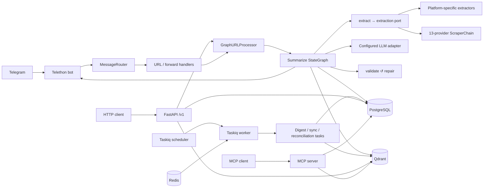
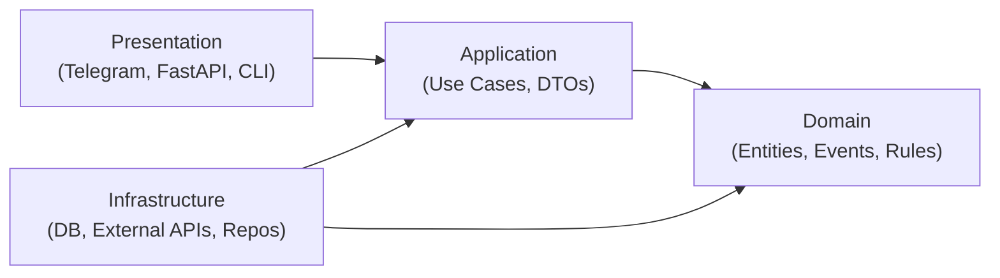
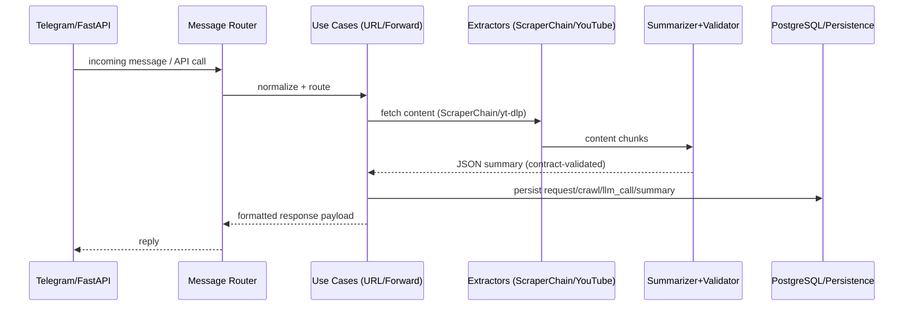

# Architecture Overview

A bird's-eye view of how Ratatoskr is wired together: the major subsystems, how a Telegram update becomes a stored summary, and where to find the canonical doc for every piece. Reach for this page when you're either evaluating the system or trying to find the right code to read first.

**Audience:** Operators evaluating Ratatoskr, contributors orienting themselves, integrators planning how to attach. **Type:** Explanation. **Related:** [`docs/SPEC.md`](../SPEC.md) (canonical contract), [`#layering-quick-reference`](#layering-quick-reference) (layer rationale), [`docs/explanation/multi-agent-architecture.md`](multi-agent-architecture.md) (LLM agent internals), [`docs/explanation/observability-strategy.md`](observability-strategy.md) (metrics, traces, logs).

---

## Goals and Non-Goals

**Goals:**

- Robust URL → content → LLM → JSON summary pipeline.
- End-to-end data capture: Telegram request, full scraper-chain output, raw LLM response, final JSON summary.
- Deterministic Summary JSON contract with validation (length caps, types, dedupe).
- Idempotence for URLs (normalized URL hash).
- Clear observability (structured logs, audit trail, latency and token metrics).
- Owner-first security with explicit user and client allowlists.

**Non-Goals:**

- A public, self-service SaaS control plane.
- Full RAG answer generation or analytics dashboards.
- Cross-user event fan-out.

---

## User and Access Control

- **Telegram bot access** is allowlist-first via `ALLOWED_USER_IDS` (comma-separated); group/supergroup chats and unauthorized DMs are rejected generically.
- **JWT API and hosted MCP auth** are allowlist-aware but intentionally fail-open when `ALLOWED_USER_IDS` is empty, which enables explicit multi-user external deployments.
- **Client-level external access** can be constrained independently via `ALLOWED_CLIENT_IDS`, secret-login provisioning rules, and rollout stages.
- All secrets pass via env vars or hashed secret storage; no plaintext secrets in DB or logs.

---

## Component diagram



The bot ingests updates via `TelegramClient`, normalizes them through `MessageHandler`, and hands them to `MessageRouter` or `CallbackHandler`. URL work reaches the same `GraphURLProcessor` facade used by other summary entry points. The channel-digest subsystem uses a separate userbot session to read channel histories; Taskiq schedules recurring digest, synchronization, and reconciliation work.

For the mobile API, routers are transport-focused and delegate infrastructure orchestration to dedicated services (`DigestFacade`, `SystemMaintenanceService`) rather than performing DB / Redis / file operations inline. `ResponseFormatter` centralizes Telegram replies and audit logging while all artifacts land in PostgreSQL.

---

## Layered view

The codebase follows a hexagonal (ports-and-adapters) layout. Each layer has a narrow job; cross-layer references go through ports, not direct imports. See [#layering-quick-reference](#layering-quick-reference) for the rationale.

| Layer | Path | Role |
| --- | --- | --- |
| Adapters | `app/adapters/` | Talk to the outside world: Telegram, scrapers, OpenRouter, YouTube, Twitter, ElevenLabs. No business logic; translate I/O to / from domain DTOs. |
| Domain | `app/domain/` | DDD entities, value objects, and pure-Python domain services. No I/O. |
| Application | `app/application/` | Use cases, DTOs, application services that orchestrate domain logic and adapter ports. |
| Infrastructure | `app/infrastructure/` | Concrete persistence (PostgreSQL), event bus, cache (Redis), HTTP clients, vector store, embedding factories. |
| Core | `app/core/` | Cross-cutting utilities: URL normalisation, JSON parsing / repair, summary-contract validation, structured logging. |
| Database | `app/db/` | SQLAlchemy 2.0 typed declarative models under `app/db/models/` and the async `Database` engine/session factory in `app/db/session.py` (the sole DB entry point). Alembic migrations in `app/db/alembic/`. |
| DI | `app/di/` | Runtime composition only — concrete dependency graphs are not assembled outside this package. |

---

## Request lifecycle: a Telegram URL becomes a stored summary

```
Telegram update
  └─ TelegramClient (raw event)
     └─ MessageHandler (normalize, persist snapshot)
        └─ AccessController (ALLOWED_USER_IDS gate)
           └─ MessageRouter
              └─ URLHandler ── URLBatchPolicyService / URLAwaitingStateStore
                 └─ GraphURLProcessor facade (correlation_id assigned == thread_id)
                    └─ Summarize StateGraph: ingest → extract → ground → build_prompt → summarize → validate ↺ repair → enrich → persist → notify
                       ├─ extract → extraction port → platform extractor or 13-provider ScraperChain
                       │   (see docs/explanation/scraper-chain.md for the detailed provider diagram)
                       ├─ summarize/repair → llm_client port → configured LLM adapter
                       │   └─ Summary JSON (validated against summary_contract.py)
                       └─ persist → PostgreSQL: summaries / llm_calls (attempt_trigger='graph_node') / requests / crawl_results + read-your-writes Qdrant point
                          └─ notify → ResponseFormatter → TelegramClient → Telegram reply
```

Durable artifacts include the request, crawl attempts, LLM calls, progress/job state, and final summary. Correlation IDs connect those records to structured logs and the user-visible error ID.

---

## Subsystem index

Each subsystem has a canonical doc; this page is the entry point.

| Subsystem | Purpose | Canonical doc |
| --- | --- | --- |
| URL pipeline | Extract content with a 13-provider chain, including URL-scoped Reddit and Hacker News rungs. Order is overridable via `SCRAPER_PROVIDER_ORDER`; cloud Firecrawl is not used. | [`docs/explanation/scraper-chain.md`](scraper-chain.md) · [`docs/SPEC.md`](../SPEC.md) |
| YouTube extractor | Download video (1080p), pull transcripts, store metadata. | [`docs/guides/configure-youtube-download.md`](../guides/configure-youtube-download.md) |
| Twitter / X extractor | Two-tier extraction: self-hosted Firecrawl scrape by default; opt-in authenticated Playwright for protected accounts, threads, and X Articles. | [`docs/guides/configure-twitter-extraction.md`](../guides/configure-twitter-extraction.md) |
| LLM summarization (graph) | The LangGraph summarize graph (`app/application/graphs/summarize/`) is the sole summarize path: ingest → extract → ground → build_prompt → summarize → validate ↺ repair → enrich → persist → notify. Self-correction is the `validate ↺ repair` cycle; the `summarize`/`repair` nodes call `instructor`'s `chat_structured` via `summarize_with_instructor`; summary prompt/schema/runtime binding goes through `SummaryContractDescriptor` so the default contract remains explicit and future variants do not require provider rewrites. | [`docs/explanation/multi-agent-architecture.md`](multi-agent-architecture.md) · [`docs/reference/summary-contract.md`](../reference/summary-contract.md) |
| Web search enrichment | Inject up-to-date context via self-hosted Firecrawl search (`FIRECRAWL_SELF_HOSTED_ENABLED=true`) before final summary. | [`docs/guides/enable-web-search.md`](../guides/enable-web-search.md) |
| Channel digest | Userbot reads subscribed channels; scheduled digests via `/digest`. | [`docs/SPEC.md`](../SPEC.md) (`Channel digest` section) |
| Mixed-source aggregation | Bundle one or more links + forwards / attachments into a single synthesised result. | [`docs/SPEC.md`](../SPEC.md) (`Mixed-source aggregation` section) |
| Search (Postgres tsvector + vector) | PostgreSQL `TSVECTOR` + `GIN` full-text plus optional Qdrant semantic / hybrid search. The persist-node fast path writes summary vectors synchronously; the Taskiq reconciler (`ratatoskr.vector.reconcile`) handles convergence and backfill. `VectorIndexReconciler` inspects indexed entity adapters for diagnostics and repair. | [`docs/guides/setup-qdrant-vector-search.md`](../guides/setup-qdrant-vector-search.md) · [`docs/vector-index-sync.md`](../vector-index-sync.md) |
| Streaming (SSE) | Real-time summary progress via `GET /v1/requests/{request_id}/stream`, with `phase`, `section`, `done`, and `error` events. Implementation: `app/adapters/content/streaming/` and `app/api/routers/content/streams.py`. | `app/adapters/content/streaming/` |
| Mobile API | FastAPI + JWT, sync v2, ratelimit, summary CRUD, aggregations. | [`docs/reference/mobile-api.md`](../reference/mobile-api.md) |
| Web frontend | FastAPI serves a compiled SPA under `/web/*`; editable React source and client checks are owned by the external `ratatoskr-web` repository. | [`docs/reference/frontend-web.md`](../reference/frontend-web.md) |
| MCP server | Model Context Protocol server with 28 tools and 17 resources for external AI agents. | [`docs/reference/mcp-server.md`](../reference/mcp-server.md) |
| Observability | Prometheus metrics, structured logs, correlation-ID tracing, Loki / Promtail / Grafana stack. | [`docs/explanation/observability-strategy.md`](observability-strategy.md) |
| Redis (optional) | Response cache, rate-limit store, sync session locks, distributed background-task locks. | [`docs/guides/setup-redis-caching.md`](../guides/setup-redis-caching.md) |
| ElevenLabs TTS (optional) | Generate audio from a stored summary on demand. | `app/adapters/elevenlabs/` (no standalone doc yet) |
| GitHub repository ingestion | Index GitHub repos through manual URL ingest or daily starred-repo sync, structured LLM analysis, Qdrant embedding, reconciler backfill, and semantic search. | [`docs/explanation/github-repository-ingestion.md`](github-repository-ingestion.md) |

---

## Agent Implementation Map

This is the implementation-first map for future agents; use it to find ownership before editing contracts or generated clients.

| Area | Backend ownership | Downstream ownership / drift checks |
| --- | --- | --- |
| Auth | `app/api/routers/auth/` maps login, refresh, logout, OAuth, and sessions; `tokens.py` creates and validates tokens; `cookies.py` controls browser refresh cookies; `auth_repository.py` persists refresh families; `RefreshToken` lives in `app/db/models/core.py`. | Client implementations live in their own repositories; the backend contract is in `docs/reference/mobile-api.md#authentication` and generated OpenAPI. |
| API contracts | FastAPI source is `app.api.main:app`; OpenAPI generation is `tools/scripts/generate_openapi.py`; committed specs are `docs/openapi/mobile_api.yaml` and `.json`; envelope models live in `app/api/models/responses/common.py`. | External clients should pin the generated specification and validate drift in their own repositories. |
| Sync | Router entrypoints are `app/api/routers/sync.py`; session/full/delta/apply behavior is split under `app/api/services/sync/`; DB reads also use `app/infrastructure/persistence/sync_aux_read_adapter.py`. | The protocol is documented in `docs/reference/sync-protocol.md`; client orchestration is external to this repository. |
| Request processing | URL requests enter through the `app/adapters/content/graph_url_processor.py` facade, which drives the summarize graph (`app/application/graphs/summarize/`) and platform extraction lifecycle helpers; durable processing jobs use `app/db/models/core.py::RequestProcessingJob`. | Common triage begins with correlation ID and `docs/reference/troubleshooting.md#request-stuck-in-processing`. |
| LLM pipeline | The `summarize`/`repair` graph nodes call `summarize_with_instructor` (`app/application/services/summarization/graph_llm.py`) via the `llm_client` port; provider creation is `app/adapters/llm/factory.py`; the shared provider contract is `app/adapters/llm/protocol.py`; concrete calls are implemented by `app/adapters/openrouter/`, `app/adapters/llm/openai/`, and `app/adapters/llm/anthropic/`; strict shaping and provider response-format construction are owned by `app/core/summary_contract.py::SummaryContractDescriptor`; the retry/repair loop is the graph's `validate ↺ repair` cycle (bounded by `MAX_REPAIR_ATTEMPTS`). | Parse failures map to `docs/reference/troubleshooting.md#json-parsing-failures`; prompt edits must keep `app/prompts/*_en.txt` and `*_ru.txt` paired and should be loaded through `PromptManager.get_contract_system_prompt()`. |
| Extraction providers | Generic provider chain is `app/adapters/content/scraper/`; platform extraction router is `app/adapters/content/platform_extraction/`; YouTube, Twitter/X, and academic papers bypass the generic chain through their dedicated adapter packages. | Provider-order and fallback behavior are documented in `docs/explanation/scraper-chain.md`; source ingestion polling is separate under `app/adapters/ingestors/` and `app/adapters/rss/`. |
| Vector and source drift | Fast-path vector writes use infrastructure vector/embedding services; reconciliation is `app/infrastructure/vector/reconciliation.py`, `app/cli/reconcile_vector_index.py`, and `app/tasks/reconcile_vector_index.py`; source ingestors feed signals through `app/adapters/ingestors/` and `app/api/routers/social/signals.py`. | Operational drift docs are `docs/vector-index-sync.md` and `docs/reference/troubleshooting.md`; add new vectorized entity types by implementing `VectorIndexedEntityAdapter` and injecting it into `VectorIndexReconciler`. |

Generated OpenAPI files are derived artifacts. Change routers/models first, run `make generate-openapi`, then run `make check-openapi-drift`, `make check-openapi-validate`, and `make check-openapi`.

---

## Where to next

- New here and want to run the bot? → [Quickstart Tutorial](../guides/quickstart.md).
- Deploying to a server? → [guides/deploy-production.md](../guides/deploy-production.md).
- Modifying the codebase? → [`CLAUDE.md`](../../CLAUDE.md) for the AI-friendly engineer's tour, then [`docs/SPEC.md`](../SPEC.md) for the canonical contract.
- Curious about layer choices? → [Layering quick reference](#layering-quick-reference).
- Tracking down a specific request? → start with the correlation ID in the user-visible error message, then read [`docs/explanation/observability-strategy.md`](observability-strategy.md).

---

## Layering quick reference

> The content below was previously in `HEXAGONAL_ARCHITECTURE_QUICKSTART.md`.

This doc keeps our layering consistent across Telegram, CLI, and the mobile API. Keep dependencies pointing inward: Domain has no outward dependencies.

## Runtime policy

- DI container is always enabled in runtime entrypoints (Telegram bot and CLI harness).
- Presentation handlers call application use cases for business workflows.
- No presentation-layer fallback path should call repositories directly for the same workflow.
- FastAPI routers remain transport-only: orchestration belongs in dedicated application/service classes.
- Adapter seams should depend on protocol contracts, not concrete `*Impl` classes, at constructor/public boundaries.

## Layer Map (project-specific)

- Presentation: `app/adapters/telegram/*`, `app/api/*`, CLI in `app/cli/*`
- Application: `app/application/use_cases/*`, DTOs in `app/application/dto/*`
- Domain: `app/domain/*` (models, events, services, exceptions)
- Infrastructure: `app/infrastructure/*`, `app/db/*`, external clients in `app/adapters/*`
- DI: `app/di/` (split by concern: `api.py`, `application.py`, `database.py`, `extraction.py`, `graphs.py`, `mcp.py`, `platform_extractors.py`, `repositories.py`, `retrieval.py`, `search.py`, `shared.py`, `social.py`, `tasks.py`, `telegram.py`, `telegram_commands.py`, `types.py`)

## DB Layer

- `Database` (`app/db/session.py`) is the sole database entry point. It owns the SQLAlchemy 2.0 `AsyncEngine` + `async_sessionmaker[AsyncSession]`, exposes `session()` / `transaction()` async context managers and the `with_serialization_retry` decorator, and runs Alembic migrations via `migrate()`.
- New business workflows should go through application use cases and repository ports in `app/infrastructure/persistence/repositories/*`, not through the session factory directly.

## Current seam examples (2026-07)

- `app/api/routers/social/digest.py` → delegates orchestration to `DigestFacade`.
- `app/api/routers/system.py` → delegates DB/Redis/file maintenance work to `SystemMaintenanceService`.
- `app/api/routers/admin.py` → delegates `/v1/admin/diagnostics` composition to `DiagnosticsService`; `AdminReadService` remains scoped to user/job/content/metrics/read operations.
- Taskiq entrypoints build dependency bundles through `app/di/tasks.py` (`DigestTaskRuntime`, `RssPollTaskRuntime`, `VectorReconcileTaskRuntime`) so background jobs do not assemble service graphs inline.
- Telegram callback flow delegates action execution through `CallbackActionRegistry` + `CallbackActionService`.
- Telegram URL flow delegates security/timeout/batch/state policy through `URLBatchPolicyService` + `URLAwaitingStateStore`.
- Formatting stack constructor seams use protocol interfaces from `app/adapters/external/formatting/protocols.py` (for example `ResponseSender`, `DataFormatter`, `TextProcessor`) instead of concrete implementation types.



## Core flow we run every day



## Quickstart: add a new use case

1) Domain: add/adjust entities or domain services in `app/domain/*` (no external deps).
2) Application: create a use case in `app/application/use_cases/` that orchestrates domain + repositories.
3) Infrastructure: ensure repository/client implementations exist in `app/infrastructure/*` or `app/adapters/*`.
4) DI: wire it in the appropriate `app/di/` module (e.g., `application.py` for use cases, `repositories.py` for repos).
5) Presentation: call the use case from Telegram handlers (`app/adapters/telegram/*`) or FastAPI (`app/api/*`), formatting responses via `app/adapters/external/response_formatter.py`.

## When to add a use case

- Any distinct workflow (e.g., mark summary read, search summaries, sync mobile).
- Reads: use query objects; writes: use command objects.

## Testing hints

- Unit: pure domain rules and use cases with mocked repositories.
- Integration: run via container wiring against test DB; validate persistence and contracts.

## Layering contracts

The layering rules above are enforced by [`import-linter`](https://import-linter.readthedocs.io/) via the `.importlinter` config at the repo root, run by the `Architecture - Import Linter (layering)` CI job. Five contracts cover the dependency direction:

- `domain-independence` — `app.domain` imports no outer layer.
- `application-no-outward` — `app.application` imports neither `app.adapters` nor `app.api` (depends on `app.application.ports.*` Protocols injected at the DI boundary).
- `infrastructure-no-api` — `app.infrastructure` does not import `app.api`.
- `tasks-no-api` — worker code (`app.tasks`) does not import `app.api`.
- `content-no-telegram` — `app.adapters.content` does not import `app.adapters.telegram` (telegram → content orchestration is allowed; the reverse would re-create the cycle).

All five are **green and gated**: the CI job runs `lint-imports` and the build fails on any regression. The *restore-architecture-layering* epic closed every known violation; if you add a new outward import the contract that owns it will fail.

Run locally with `lint-imports` (all contracts) or `lint-imports --contract <id>` after `pip install import-linter` in an environment where `app` is importable.
