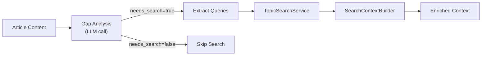

# Multi-Agent Architecture

Agents wrap extraction, summarization, validation, and repository analysis with structured results, retries, and observability. Classic `BaseAgent` wrappers remain the stable interface for content flows; `instructor`'s `chat_structured(max_retries=N)` owns the summarize/validate retry loop at `app/adapters/content/pure_summary_service.py`; LangChain structured output is preferred for repository analysis when the selected LLM adapter supports it.

## Roles

- **ContentExtractionAgent** — scraper chain / YouTube fetch; persists crawl artifacts. The scraper chain tries up to 8 providers (Scrapling → Crawl4AI → Firecrawl self-hosted → Defuddle → Playwright → Crawlee → direct HTML → ScrapeGraphAI) before failing.
- **ValidationAgent** — Enforces `summary_contract` (length caps, deduped tags/entities).
- **WebSearchAgent** — Analyzes content for knowledge gaps; executes targeted web searches to enrich context.
- **RepoAnalysisAgent** — Produces `RepoAnalysis` through structured LLM output for GitHub repository ingestion, with legacy JSON fallback.
- All inherit `BaseAgent[TInput, TOutput]` with `success`, `output`, `error`, `metadata`.

The self-correction retry loop (up to `max_retries` attempts) lives in `app/adapters/content/pure_summary_service.py:_summarize_with_instructor` and is backed by `instructor`'s `chat_structured`. This is the production path; there is no agent-layer orchestrator in the summarization hot-path.

## Usage

- Extraction:

```python
agent = ContentExtractionAgent(content_extractor, correlation_id="abc123")
result = await agent.execute(ExtractionInput(url="https://example.com", correlation_id="abc123"))
```

## Integration

- Used in `app/application/use_cases/summarize_url.py` and by the API background processor.
- Wraps `ContentExtractor`/`LLMSummarizer`, adds retries, validation, and correlation-aware logging.
- Repository analysis lives in `app/agents/repo_analysis_agent.py` and stores the structured result in `repositories.analysis_json`.
- Signal scoring v0 keeps deterministic source ingestion, MinHash dedupe, Qdrant similarity, source diversity, and the 10% LLM cap outside the agent layer in `app/application/services/signal_scoring.py` and `app/application/services/signal_ingestion_worker.py`.
- The LLM-as-judge step is intentionally a bounded service (`app/application/services/signal_judge.py`), not a replacement orchestration agent. It reuses the project LLM client contract, validates structured output, records cost/evidence, and only runs for candidates admitted by the cheap filter cap.
- Existing extraction/validation agents remain available for one-off URL and aggregation flows.

## Testing

- Unit: mock scraper chain providers / LLM; assert retries and validation errors are surfaced.
- Integration: fixtures; expect `validation_attempts > 1` when schema errors injected.
- Signal tests: `tests/application/test_signal_scoring.py`, `tests/application/test_signal_ingestion_worker.py`, and `tests/application/test_signal_judge.py` cover deterministic filtering, worker persistence, and bounded judge behavior separately from the agent tests.

## WebSearchAgent (optional enrichment)

When `WEB_SEARCH_ENABLED=true`, WebSearchAgent enriches content with current web context:



### Input/Output

```python
class WebSearchAgentInput(BaseModel):
    content: str           # Article content to analyze
    language: str = "en"   # Target language
    correlation_id: str | None = None

class WebSearchAgentOutput(BaseModel):
    searched: bool         # Whether search was executed
    context: str           # Formatted search context (empty if not searched)
    queries_executed: list[str]  # Actual queries run
    articles_found: int    # Number of search results
    reason: str            # Explanation (why search needed/skipped)
```

### Usage

```python
from app.agents.web_search_agent import WebSearchAgent, WebSearchAgentInput

agent = WebSearchAgent(
    llm_client=llm_client,
    search_service=topic_search,
    cfg=web_search_config,
    correlation_id="abc123",
)

result = await agent.execute(WebSearchAgentInput(
    content=article_content,
    language="en",
))

if result.success and result.output.context:
    # Inject context into summarization prompt
    enriched_prompt = f"{original_prompt}\n\n{result.output.context}"
```

### Integration

- Integrated into `LLMSummarizer._maybe_enrich_with_search()`
- Called before main summarization when enabled
- Uses `SearchContextBuilder` to format results as markdown
- Gracefully handles failures (continues without enrichment)

## Files

- `app/agents/base_agent.py`
- `app/agents/content_extraction_agent.py`
- `app/agents/validation_agent.py`
- `app/agents/web_search_agent.py`
- `app/adapters/content/pure_summary_service.py` (retry loop)
- `app/adapters/content/search_context_builder.py`
- `app/prompts/search_analysis_en.txt`
- `app/prompts/search_analysis_ru.txt`
