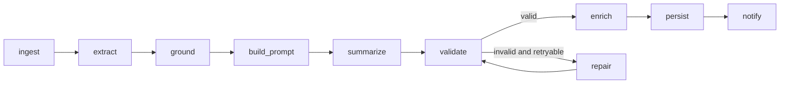
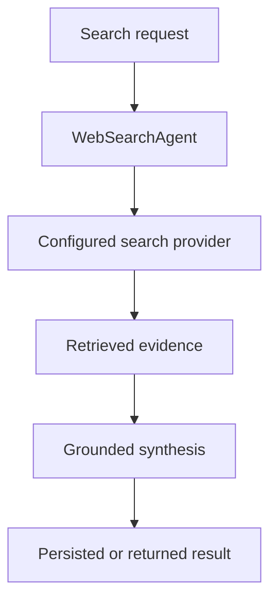

# Graph and agent architecture

Ratatoskr does not use a general-purpose agent swarm for ordinary URL summaries. The production summary path is a deterministic LangGraph workflow; focused agents are used only where a task benefits from search, aggregation, relationship analysis, or repository-specific reasoning.

## Summary workflow

`GraphURLProcessor.handle_url_flow` is the sole summary entry point. It invokes the graph assembled in `app/application/graphs/summarize/graph.py`.

The nodes share typed state and injected dependencies. Extraction, LLM calls, validation, repair, persistence, and notification remain explicit stages so retries and diagnostics have stable boundaries.

## Focused agents

Current agent wrappers live in `app/agents/`:

| Agent | Responsibility |
|---|---|
| `WebSearchAgent` | Search the web and synthesize grounded results. |
| `MultiSourceExtractionAgent` | Extract comparable evidence from several sources. |
| `MultiSourceAggregationAgent` | Merge multiple source results into one response. |
| `CombinedSummaryAgent` | Compose summaries from already acquired material. |
| `RelationshipAnalysisAgent` | Analyze relationships among entities or sources. |
| `RepoAnalysisAgent` | Produce structured analysis for GitHub repository ingestion. |

Shared behavior belongs in `BaseAgent`; runtime composition belongs in `app/di/`. These agents are not hidden alternate routes around the summary graph.

A representative search flow is:

## Boundaries

- Scraping providers are selected by the extraction subsystem, not autonomously invented by an agent.
- Summary JSON is accepted only after validation against the descriptor in `app/core/summary_contract.py`.
- Retries and repair attempts are bounded and persisted with their correlation context.
- Agent output does not bypass authorization, persistence, audit logging, or user-visible error requirements.
