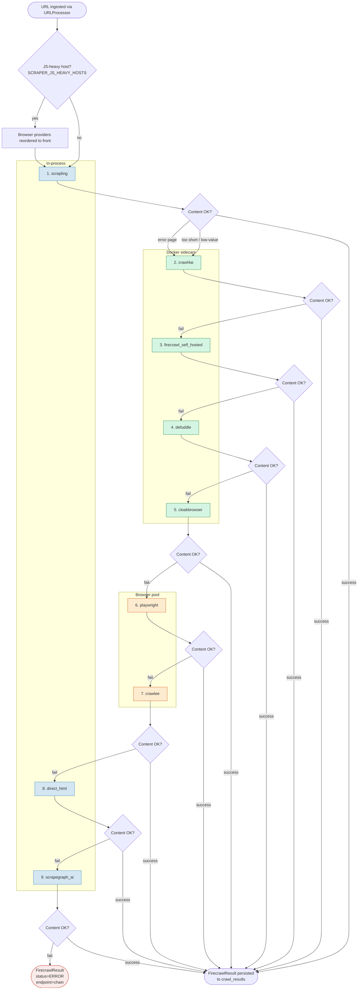
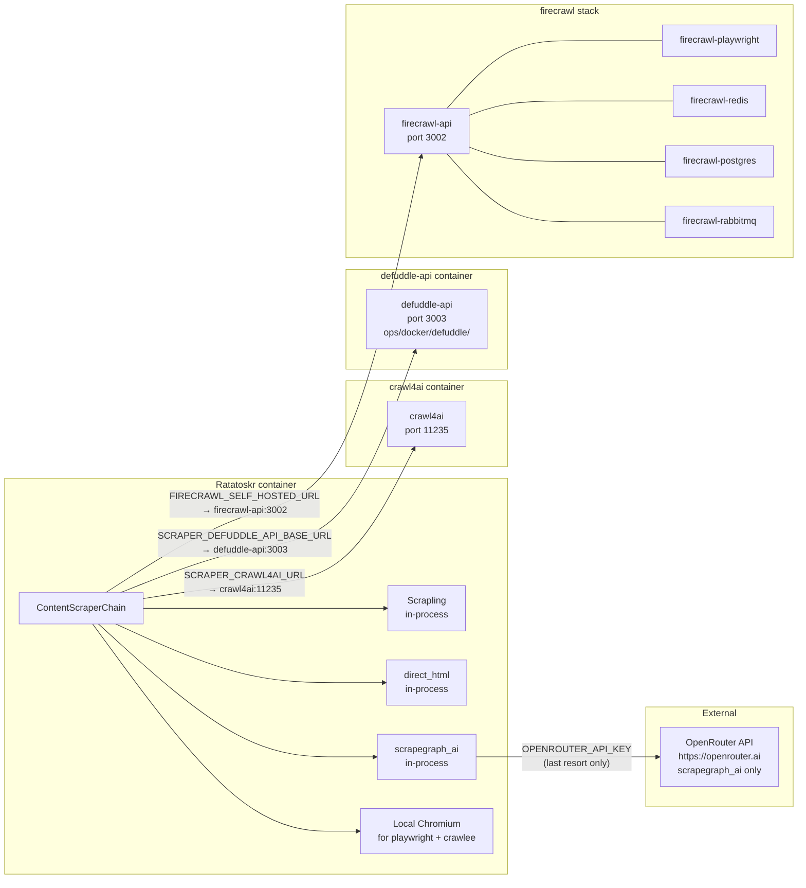

# Scraper Chain

How Ratatoskr extracts clean article content from arbitrary URLs: the provider taxonomy, fallback logic, deployment topology, quality gates, and configuration recipes.

**Audience:** Contributors and operators who need to understand, tune, or extend the content-extraction pipeline. **Type:** Explanation. **Related:** [`docs/explanation/architecture-overview.md`](architecture-overview.md) (parent), [`docs/reference/environment-variables.md`](../reference/environment-variables.md) (full env-var reference), [`docs/explanation/faq.md`](../explanation/faq.md) (operational tips). **Source:** [`app/adapters/content/scraper/chain.py`](../../app/adapters/content/scraper/chain.py), [`factory.py`](../../app/adapters/content/scraper/factory.py), [`protocol.py`](../../app/adapters/content/scraper/protocol.py), [`scrapling_provider.py`](../../app/adapters/content/scraper/scrapling_provider.py), [`crawl4ai_provider.py`](../../app/adapters/content/scraper/crawl4ai_provider.py), [`defuddle_provider.py`](../../app/adapters/content/scraper/defuddle_provider.py), [`firecrawl_provider.py`](../../app/adapters/content/scraper/firecrawl_provider.py), [`playwright_provider.py`](../../app/adapters/content/scraper/playwright_provider.py), [`crawlee_provider.py`](../../app/adapters/content/scraper/crawlee_provider.py), [`direct_html_provider.py`](../../app/adapters/content/scraper/direct_html_provider.py), [`scrapegraph_provider.py`](../../app/adapters/content/scraper/scrapegraph_provider.py).

---

## Overview

`ContentScraperChain` is the content-extraction layer that sits between `URLProcessor` and the LLM summarization step. It holds an ordered list of provider instances and tries each in turn until one returns substantive, high-quality content. Every provider implements `ContentScraperProtocol` and returns a `FirecrawlResult`, so downstream code never needs to know which provider actually served the request; the `endpoint` field on the returned result is set to the winning provider's name (or `"chain"` on total failure). Results are persisted to the `crawl_results` table regardless of outcome.

---

## Provider taxonomy

| Provider | Tier | Default position | Self-hosted requirement |
| --- | --- | --- | --- |
| `scrapling` | in-process | 1 | None — pure Python (curl_cffi / Playwright via DynamicFetcher) |
| `crawl4ai` | Docker sidecar | 2 | `crawl4ai` container at `SCRAPER_CRAWL4AI_URL` |
| `firecrawl_self_hosted` | Docker sidecar | 3 | `firecrawl-api` stack at `FIRECRAWL_SELF_HOSTED_URL` |
| `defuddle` | Docker sidecar | 4 | `defuddle-api` container at `SCRAPER_DEFUDDLE_API_BASE_URL` |
| `cloakbrowser` | browser sidecar (CDP) | 5 | `cloakbrowser` container at `SCRAPER_CLOAKBROWSER_URL` (Playwright `connect_over_cdp`) |
| `playwright` | browser pool (in-process) | 6 | Chromium installed via `playwright install chromium` |
| `crawlee` | browser pool (in-process) | 7 | Chromium (same as playwright) |
| `direct_html` | in-process | 8 | None — raw httpx fetch + trafilatura |
| `scrapegraph_ai` | in-process (LLM-driven) | 9 | `scrapegraphai` package + valid `OPENROUTER_API_KEY` |

Provider position 3 (`firecrawl`) is active only when `FIRECRAWL_SELF_HOSTED_ENABLED=true`; cloud Firecrawl is not used for article scraping. Position 9 (`scrapegraph_ai`) is active only when `scrapegraphai` is installed and `OPENROUTER_API_KEY` is set.

Position 5 (`cloakbrowser`) is the stealth-browser rung — an [upstream CloakHQ/CloakBrowser](https://github.com/CloakHQ/CloakBrowser) sidecar in `cloakserve` CDP mode that drives a Chromium build with C++ source-level fingerprint patches (canvas, WebGL, GPU, WebRTC, UA). It runs under the `with-scrapers` Docker profile and is reached over the internal Docker network only. The upstream binary is licensed for use but not redistribution, so we always pull the upstream image rather than rebake it — pin to a specific tag in `ops/docker/docker-compose.yml` rather than `latest`. When the sidecar is absent (no `with-scrapers` profile) the provider build still appears in the chain but the per-call connection fails fast, and the chain falls through to in-process `playwright` exactly as it does today when `crawl4ai` is down.

---

## Chain execution and fallback



Each rung applies the quality gates described in the next section before deciding whether to return or continue to the next provider. "Content OK" means the result passed all gates; any gate failure advances the chain.

---

## Deployment topology



All sidecar connections are optional: a provider that cannot reach its sidecar returns an error result and the chain continues. The `scrapegraph_ai` provider is the only one that contacts an external endpoint (OpenRouter), and only as a last resort.

### Operator surfaces (Crawl4AI sidecar)

- **Interactive playground** — `http://crawl4ai:11235/playground` lets you test crawl requests against the live sidecar from a browser UI.
- **Real-time dashboard** — `http://crawl4ai:11235/dashboard` shows active crawl jobs, queue depth, and resource usage.

---

## Quality gates per rung

`ContentScraperChain.scrape_markdown` applies these gates to every provider result before deciding to accept or fall through:

- **`_is_error_page`** — regex match against HTTP error patterns (403, 404, 401, "access denied", Russian equivalents) on bodies shorter than 1 500 characters. Short bodies matching a pattern are rejected.
- **`min_content_length`** — rejects content shorter than the configured threshold (default 400 chars; controlled by `SCRAPER_MIN_CONTENT_LENGTH`). Applied only when `min_content_length > 0`.
- **`detect_low_value_content`** — quality filter that scores character count, word count, and content signal density. Applied when `min_content_length > 0`.
- **JS-heavy reorder** — when the request URL matches a host in `SCRAPER_JS_HEAVY_HOSTS`, browser providers (`playwright`, `crawlee`) are moved to the front of the effective provider list before any rung is tried.
- **SSRF preflight** — user-submitted target URLs are checked before provider delivery. Localhost, RFC1918/private networks, link-local/metadata ranges, reserved ranges, DNS results that resolve to blocked ranges, and non-http(s) schemes are rejected. `SCRAPER_ALLOW_PRIVATE_NETWORK_URLS=true` is only for isolated local development and does not allow metadata, link-local, reserved, or non-http(s) targets.

Providers that delegate fetching to sidecars or third-party libraries still cannot enforce redirect-hop checks inside that delegated runtime. The chain blocks obvious dangerous initial targets before calling those providers; backend-controlled `httpx` providers additionally perform per-hop redirect checks with connection-time DNS pinning.

---

## Anti-fingerprinting

The browser-based providers (`playwright`, `crawlee`) and `scrapling`'s `DynamicFetcher` path all integrate browser fingerprint randomization following the same design as `apify/fingerprint-suite`. `PlaywrightProvider` generates a randomized user-agent and viewport on each request. `CrawleeProvider` uses a `DefaultFingerprintGenerator` that rotates headers, viewport dimensions, and platform strings. `ScraplingProvider`'s `DynamicFetcher` (Playwright-based) inherits Scrapling's built-in TLS and browser fingerprint impersonation. The goal is to avoid consistent browser signatures that would be blocked by bot-detection middleware.

---

## Configuration recipes

### Single provider for testing

Force all requests through one provider; the chain ignores the rest.

```env
SCRAPER_FORCE_PROVIDER=crawl4ai
```

### Custom provider order biased toward Firecrawl first

Override the default order. Providers not listed are not instantiated.

```env
SCRAPER_PROVIDER_ORDER=firecrawl,scrapling,crawl4ai,defuddle,playwright,crawlee,direct_html
```

Note: `firecrawl` in the order only activates when `FIRECRAWL_SELF_HOSTED_ENABLED=true`; without it the factory skips that slot and the effective order shifts up.

### Disable the LLM rung

`scrapegraph_ai` is already excluded from the chain when `OPENROUTER_API_KEY` is unset. To disable it explicitly when the key is present:

```env
SCRAPER_SCRAPEGRAPH_ENABLED=false
```

---

## Cross-references

- Parent architecture: [`docs/explanation/architecture-overview.md`](architecture-overview.md)
- All scraper env vars: [`docs/reference/environment-variables.md`](../reference/environment-variables.md)
- Operational tips: [`docs/explanation/faq.md`](../explanation/faq.md)
- Source — chain: [`app/adapters/content/scraper/chain.py`](../../app/adapters/content/scraper/chain.py)
- Source — factory: [`app/adapters/content/scraper/factory.py`](../../app/adapters/content/scraper/factory.py)
- Source — protocol: [`app/adapters/content/scraper/protocol.py`](../../app/adapters/content/scraper/protocol.py)
