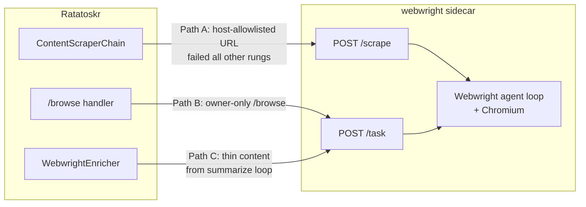

# Webwright Integration

How Ratatoskr uses Microsoft Webwright as a heavyweight, last-resort browser-agent surface — what it costs, where it sits, and the three integration paths that share the same sidecar.

**Audience:** Contributors deciding when Webwright is the right tool, operators tuning cost/coverage, and reviewers triaging a Webwright run that failed.
**Type:** Explanation.
**Related:** [`scraper-chain.md`](scraper-chain.md) (parent — Webwright is the chain's last rung), [`environment-variables.md`](../reference/environment-variables.md) (full `WEBWRIGHT_*` surface), [`data-model.md`](../reference/data-model.md) (`webwright_runs` / `user_browser_sessions` tables).
**Source:** [`ops/docker/webwright/`](../../ops/docker/webwright/) (sidecar), [`app/adapters/webwright/`](../../app/adapters/webwright/) (Ratatoskr-side adapters), [`app/adapters/content/scraper/webwright_provider.py`](../../app/adapters/content/scraper/webwright_provider.py), [`app/adapters/telegram/command_handlers/browse_handler.py`](../../app/adapters/telegram/command_handlers/browse_handler.py).

---

## What Webwright is

[Microsoft Webwright](https://github.com/microsoft/Webwright) is a research browser-agent framework that treats web automation as **code-as-action**: the LLM is handed a terminal that can spawn Playwright browser sessions, and each task is solved as a single re-runnable Python script. Microsoft reports SOTA on Online-Mind2Web (86.7%) and Odysseys (60.1%, +15.6 pts over prior SOTA).

Inside Ratatoskr it is **not** a replacement for the scraper chain. A normal Defuddle scrape costs essentially nothing; a Webwright run is an LLM-driven Playwright agent loop that costs roughly **10–30× per URL**. The integration question is therefore not "how do we wire it everywhere?" but "where does code-as-action browsing unlock something the rest of the chain cannot?"

Three answers, three integration paths, one shared sidecar.

---

## Three integration paths



### Path A — last-resort scraper rung (`webwright_provider`)

The chain's 10th and final tier. Fires only when **all** earlier providers (Scrapling, Crawl4AI, Firecrawl, Defuddle, CloakBrowser, Playwright, Crawlee, direct HTML, ScrapegraphAI) failed AND the URL host appears in `WEBWRIGHT_HOST_ALLOWLIST`. Empty allowlist → `_build_webwright` returns `None` so the provider isn't even constructed; an explicit `*` accepts any host (not recommended for cost reasons).

Use this for paywall-walled or SPA articles the rest of the chain cannot crack (Substack premium, gated docs sites, JS dashboards). The sidecar's `POST /scrape` endpoint receives a single URL plus a fixed extraction prompt; the response is shaped to fit `FirecrawlResult` so downstream code (quality gates, persistence, summarization) does not need to know which provider served the request.

Telemetry stamps: `crawl_results.winning_provider = 'webwright'`, `options_json._chain_attempt_log` shows the prior rungs as `error`/`too_short`, and `options_json._webwright_trajectory` records the sidecar's run-directory path so screenshots and the step trace can be recovered after the fact.

### Path B — owner-only `/browse <task>` Telegram command

Long-horizon interactive surface: "log into LinkedIn and summarize my saved items," "extract today's headlines from this dashboard," "fill out this form and tell me what you find." Access is already gated by `ALLOWED_USER_IDS` upstream; `/browse` does not add its own ownership check.

The handler (`BrowseHandler`) writes a `webwright_runs` row in `RUNNING` state, invokes the sidecar's `POST /task` with the user's natural-language task, and updates the row with the terminal state (`completed` / `error` / `timeout` / `cancelled`) plus the trajectory metadata. The final answer is replied to the chat (capped at ~3.5 KB to fit Telegram's message ceiling) with the full payload preserved in Postgres.

Site cookies (paywall sessions, logged-in state) are stored encrypted at rest in `user_browser_sessions` and decrypted only inside the sidecar at task time. Encryption reuses the existing `GITHUB_TOKEN_ENCRYPTION_KEY` Fernet rotation surface via `app.security.secret_crypto` — one rotation surface for all stored secrets.

### Path C — `WebwrightEnricher` content-enrichment service

A reusable service the summarize loop or any downstream consumer can call when the cheap scrape returned content that is too thin, paywalled, or otherwise impoverished. It exposes one method:

```python
await enricher.maybe_enrich_url(
    url=...,
    current_content=...,           # what the chain produced; gates the call
    correlation_id=...,
)
```

The service short-circuits cheaply (returns `None`) when the host isn't allowlisted or the current content already exceeds `min_content_length`. Only when a Webwright run actually improves things does it return an `EnrichmentResult` with `body_markdown`, `title`, trajectory path, steps used, and LLM cost.

The `LLMCall.attempt_trigger` Postgres enum has a `webwright_tool` value reserved for the re-summarization that follows an enrichment call. The enricher itself does not write `LLMCall` rows — that's the responsibility of the caller invoking the summarizer with the enriched payload, so the row trail stays a single contract.

> **Not implemented in this commit:** the full OpenRouter `tools` / `tool_choice` surface that would let the LLM itself decide to call Webwright as a tool mid-summarization. That refactor is gated on Phase A's host-allowlist metrics — once we know which hosts justify Webwright reliably, wiring tool-calling becomes worth the surface change. Until then `WebwrightEnricher` is callable by any consumer that wants to use it between summarize attempts.

---

## Sidecar architecture

```mermaid
flowchart TD
    subgraph Compose[docker compose --profile with-webwright]
        SC["webwright service\nops/docker/webwright/\nport 8090"]
        SC --> Server[server.py\nFastAPI]
        Server --> Loop[Webwright agent loop\nupstream Python module\npinned by WEBWRIGHT_REF]
        Loop --> Chromium[Chromium\nMicrosoft Playwright base image]
        Loop --> OpenRouter[OpenAI-compatible endpoint\nOPENAI_BASE_URL=OpenRouter\nOPENAI_API_KEY=OPENROUTER_API_KEY]
        Loop --> Volume[/data/webwright\ntrajectories + screenshots\nbind-mounted to host]
    end

    Ratatoskr[ratatoskr / worker / mobile-api] -- "POST /scrape (Path A)" --> Server
    Ratatoskr -- "POST /task (Paths B, C)" --> Server
```

**Build characteristics:**

- Base image: `mcr.microsoft.com/playwright/python:v1.48.0-jammy` — gives us a known-good Chromium + system deps without rebuilding them.
- Upstream pinned by **commit SHA**, not by version tag (Webwright has no published releases yet). The `WEBWRIGHT_REF` build-arg is the single point of truth; bump it deliberately, never trust `main`.
- Heavy: Webwright + Chromium image runs ~1.5 GB. The compose deploy reserves 512 MB RAM / 0.25 CPU and caps at 2 GB / 1.0 CPU.
- Off by default: the `with-webwright` compose profile is opt-in, so the standard `docker compose up` never starts the sidecar.

**Runtime contract:**

- `X-Correlation-Id` header is forwarded into the sidecar's environment and into Webwright's logs so trajectories on disk join back to the originating Ratatoskr request (Operating Rule 1).
- The agent loop runs Webwright via its CLI (`webwright run --task ...`) as a subprocess of the FastAPI server. This intentionally trades a little overhead for **stability**: upstream's Python API is pre-release and may rename internals, while the CLI contract is the documented public surface.
- Trajectories land under `WEBWRIGHT_OUTPUTS_DIR=/data/webwright/<correlation_id>/` and are bind-mounted to `data/webwright/` on the host so they survive container restarts and are reachable from the bot for the `_webwright_trajectory` path stamped into `crawl_results.options_json`.

**Pi gotcha:** Webwright + Chromium on a Raspberry Pi 4 / 5 ARM64 will be slow because the upstream Playwright image is Ubuntu-based and the agent loop runs a full browser. Two options: either accept the slowness for `/browse` on the Pi (`make pi-deploy` does **not** ship the sidecar — its image is built only when `docker compose build webwright` is run on a host that supports `linux/arm64`), or restrict the compose service to an x86 host via the `profiles: ["with-webwright"]` gate. The bot, worker, and mobile-api remain on the Pi as today.

---

## Cost containment

Three hard gates keep Webwright from running away with the LLM budget. All three are off-by-default:

1. **Feature flag.** `WEBWRIGHT_ENABLED=false` — the provider is never constructed.
2. **Host allowlist.** `WEBWRIGHT_HOST_ALLOWLIST=` (empty) — the provider is constructed but every call short-circuits with `host_not_allowlisted` before any sidecar invocation.
3. **Compose profile.** `with-webwright` not active — the sidecar container is not running, so even allowlisted URLs error out cleanly at the HTTP layer.

Per-run knobs:

- `WEBWRIGHT_MAX_STEPS=20` — bounds agent loop iterations.
- `WEBWRIGHT_TIMEOUT_SEC=180` — wall-clock cap. Client-side timeout is `timeout + 5s` so the sidecar gets a chance to return its structured timeout response instead of httpx aborting first.
- `WEBWRIGHT_MODEL` — picks the cheapest competent model by default (`openai/gpt-4o-mini`); routed via OpenRouter using its OpenAI-compatible endpoint.

Per-request audit: every `LLMCall` row written by the re-summarization that follows enrichment carries `attempt_trigger='webwright_tool'`, and every Webwright run produces one row in `webwright_runs` (Path B) or one entry in `crawl_results.options_json._chain_attempt_log` (Path A). Cost growth over a long horizon is queryable from these two tables alone.

---

## Operational recipes

### Bringing the sidecar up locally

```bash
# Build the sidecar image (takes ~5 minutes the first time)
docker compose -f ops/docker/docker-compose.yml --profile with-webwright build webwright

# Bring up the sidecar alongside the standard stack
docker compose -f ops/docker/docker-compose.yml --profile with-webwright up -d webwright

# Verify health
curl -fsS http://localhost:8090/health
# {"status":"ok"}
```

### Enabling Path A (scraper rung)

```env
WEBWRIGHT_ENABLED=true
WEBWRIGHT_HOST_ALLOWLIST=example.substack.com,docs.gated.io
```

Re-deploy the bot/worker so they pick up the new env. The chain attempt log will start showing `webwright` rows for matching hosts.

### Enabling Path B (`/browse`)

`/browse` works automatically once the sidecar is up — no scraper config required. Test:

```
/browse Visit example.com and tell me what's on the homepage.
```

The bot replies with a "Run ID: NN, Error ID: <correlation_id>" acknowledgement, then a final reply when the run completes (`completed` / `error` / `timeout`). Inspect persistence with:

```bash
docker exec ratatoskr-postgres psql -U ratatoskr_app -d ratatoskr -c \
    "SELECT id, status, steps_used, llm_cost_usd, error_text \
     FROM webwright_runs ORDER BY id DESC LIMIT 5;"
```

### Reading a trajectory

Bind-mounted trajectories live at `data/webwright/<correlation_id>/`. The `report.json` next to each run records the final answer, steps used, and the cost the upstream agent attributed to itself.

---

## When NOT to use Webwright

- **Plain articles.** Defuddle, Crawl4AI, and Firecrawl already do "fetch + extract main text" in <1s for pennies. Adding Webwright to those URLs is pure cost overhead.
- **Sites the chain already handles.** If Scrapling or Crawl4AI returned >400 chars of clean markdown, the chain stops before reaching the Webwright rung. The `host_not_allowlisted` short-circuit guards the rest.
- **Anything time-sensitive.** Each run is 10s–3min depending on `WEBWRIGHT_MAX_STEPS`. Don't put Webwright on a code path that needs to respond in real-time.
- **Untrusted task input.** `/browse` is owner-only by design — single-tenant. Webwright will *do* what you ask it to (log in, fill forms), so the chat interface is intentionally locked to `ALLOWED_USER_IDS`.

---

## See also

- [Scraper Chain](scraper-chain.md) — Webwright is the 10th rung; chain-level fallback logic lives there.
- [Environment Variables](../reference/environment-variables.md) — full `WEBWRIGHT_*` surface with bounds.
- [Data Model](../reference/data-model.md) — `webwright_runs`, `user_browser_sessions`, `RequestType.WEBWRIGHT`, `LLMAttemptTrigger.webwright_tool`.
- [Microsoft Webwright](https://github.com/microsoft/Webwright) — upstream repo + blog post linking the benchmark results.
