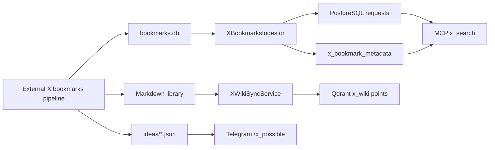

# X bookmarks integration

Ratatoskr consumes two read-only products of the external X bookmarks pipeline:
a SQLite bookmark database and a Markdown knowledge library. It does not
authenticate to X or write to those sources.

## Bookmark import

`app/adapters/ingestors/x_bookmarks_ingestor.py::XBookmarksIngestor` opens the
configured SQLite database read-only, imports only unseen bookmarks, and writes
request plus `x_bookmark_metadata` records to PostgreSQL. Imported requests
finish in the `x_imported` terminal state; this path does not invoke the scraper
or summary graph.

The scheduled task is `ratatoskr.x.sync_bookmarks` in
`app/tasks/x_bookmarks_sync.py`. Relevant defaults are:

- `X_BOOKMARKS_SYNC_ENABLED=true` in application config; production Compose
  overrides it to `false` unless the operator enables it;
- `X_BOOKMARKS_SYNC_CRON=*/15 * * * *`;
- `X_BOOKMARKS_DB_PATH=/x_bookmarks/bookmarks.db`.

`app/mcp/x_search_service.py` exposes bookmark search through PostgreSQL
full-text search.

## Wiki index

`app/tasks/x_wiki_sync.py::XWikiSyncService` scans the configured Markdown
library, writes deterministic `x_wiki` vector points to Qdrant, and removes
orphaned points. It does not mirror the Markdown documents into PostgreSQL.

The scheduled task is `ratatoskr.x.sync_wiki`. Defaults are:

- `X_WIKI_SYNC_CRON=0 * * * *`;
- `X_WIKI_LIBRARY_PATH=/x_bookmarks/library`;
- `X_IDEAS_PATH=/x_bookmarks/ideas`.

The `/x_possible` Telegram command, implemented in
`app/adapters/telegram/command_handlers/x_possible.py` and registered through
`app/di/telegram_commands.py`, reads the newest generated JSON file under
`X_IDEAS_PATH`. It is separate from the Qdrant wiki index.

## Operational boundaries

- Mount the database and Markdown library read-only wherever possible.
- Treat missing or inaccessible external files as ingestion failures, not as
  permission to create replacement sources.
- Bookmark FTS and wiki vector search are distinct indexes with distinct
  consistency models.
- The sync jobs are incremental and idempotent; run them through Taskiq
  scheduling or their task entry points rather than editing database rows.
