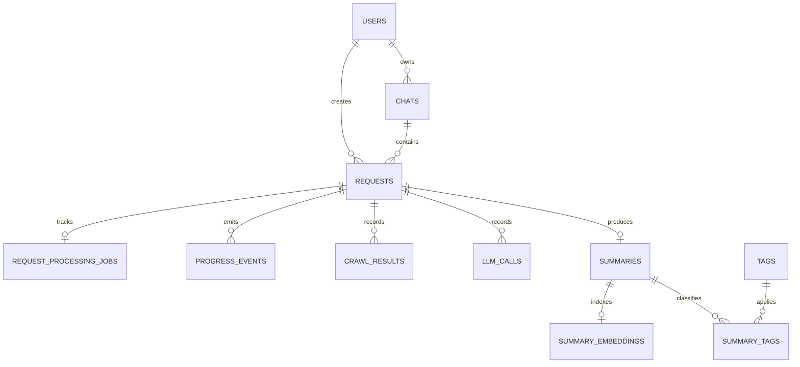

# Data model

Ratatoskr stores durable application state in PostgreSQL through SQLAlchemy 2.0. The executable source of truth is `app/db/models/`; `app/db/models/__init__.py::ALL_MODELS` registers every model used by migrations and schema checks. Alembic revisions live in `app/db/alembic/versions/`.

This page is a map of the current schema, not a substitute for generated DDL. As of 2026-07-15, `ALL_MODELS` contains 81 tables.

## Table catalog

| Area | Tables |
|---|---|
| Aggregation | `aggregation_sessions`, `aggregation_session_items` |
| AI backup | `ai_account_backups` |
| Batch | `batch_sessions`, `batch_session_items` |
| Collections | `collections`, `collection_items`, `collection_collaborators`, `collection_invites`, `collection_public_links` |
| Core | `users`, `client_secrets`, `user_credentials`, `user_identities`, `magic_link_tokens`, `chats`, `requests`, `request_processing_jobs`, `progress_events`, `telegram_messages`, `crawl_results`, `llm_calls`, `summaries`, `user_interactions`, `audit_logs`, `summary_embeddings`, `video_downloads`, `audio_generations`, `attachment_processing`, `user_devices`, `refresh_tokens`, `x_bookmark_metadata` |
| Digest | `channels`, `channel_categories`, `channel_subscriptions`, `channel_posts`, `channel_post_analyses`, `digest_deliveries`, `user_digest_preferences`, `user_email_addresses`, `email_deliveries` |
| Export | `user_export_integrations`, `export_delivery_logs` |
| Git backup | `git_mirrors` |
| Repositories | `repositories`, `repository_embeddings`, `user_repository_watches`, `user_github_integrations` |
| RSS | `rss_feeds`, `rss_feed_subscriptions`, `rss_feed_items`, `rss_item_deliveries` |
| Rules and webhooks | `webhook_subscriptions`, `webhook_deliveries`, `automation_rules`, `rule_execution_logs`, `import_jobs`, `user_backups` |
| Search | `saved_searches`, `search_history` |
| Signals | `sources`, `subscriptions`, `feed_items`, `topics`, `user_signals` |
| Social connections | `social_connections`, `social_auth_states`, `social_fetch_attempts` |
| Taskiq | `taskiq_failed_jobs` |
| Topic search | `topic_search_index` |
| Transcription | `transcription_jobs`, `transcription_artifacts`, `transcription_progress_events` |
| User content | `summary_feedbacks`, `custom_digests`, `summary_highlights`, `user_goals`, `tags`, `summary_tags` |
| Webwright | `webwright_runs`, `user_browser_sessions` |

## Core request lifecycle



The diagram intentionally shows only the request-and-summary spine. Foreign keys, indexes, constraints, enums, and retention fields must be read from the model and Alembic revision that owns them.

## Invariants

- `app/db/session.py::Database` is the application entry point for async sessions and transactions.
- Schema changes require a SQLAlchemy model change and an Alembic migration. Add the model to `ALL_MODELS` when introducing a new model module.
- PostgreSQL full-text search uses `TSVECTOR` columns and GIN indexes where defined by the owning model or migration.
- Qdrant is a derived vector index, not the relational source of truth. Reconciliation behavior is documented in [Vector index synchronization](../vector-index-sync.md).
- Secrets such as GitHub tokens are encrypted before persistence; application logs must not expose their plaintext values.

## Schema operations

Apply migrations through the project CLI:

```bash
python -m app.cli.migrate_db --apply
```

Create or review revisions under `app/db/alembic/` and validate the affected models and repositories with targeted tests. Do not edit a deployed schema manually or infer it from this catalog alone.
