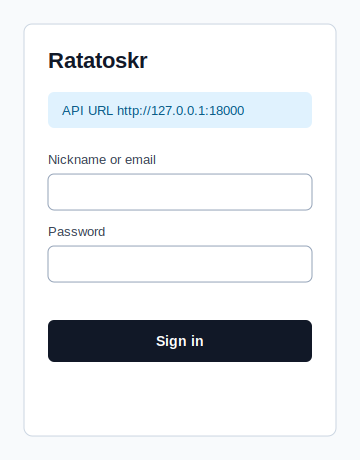
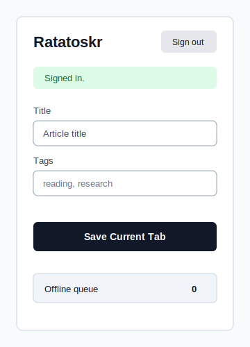
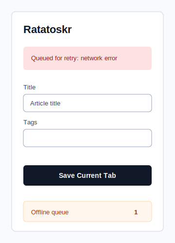

# Ratatoskr Quick Save Extension

Manifest V3 browser extension for saving the current tab to Ratatoskr through `POST /v1/quick-save`.

## Supported Browsers

- Chrome / Chromium / Edge: load `extension/` as an unpacked extension.
- Firefox support is tracked separately because the current package ships a Chrome-compatible Manifest V3 service worker.

## Local Install

1. Start the Ratatoskr API and make sure browser-extension auth is enabled with `JWT_SECRET_KEY` and `ALLOWED_CLIENT_IDS` containing `browser-extension`.
2. Open the browser extension developer page.
3. Load this `extension/` directory as an unpacked extension.
4. Click the toolbar button, set the API URL, and sign in with nickname/email credentials.
5. Open an article tab and click the toolbar button again. The popup quick-saves the current tab immediately; **Save Current Tab** remains available for edited titles, tags, and resubmits.

## Runtime Behavior

- Access and refresh tokens are stored in `chrome.storage.session` by default. When **Remember refresh session** is checked, both tokens are stored in `chrome.storage.local` so refresh survives browser restart. Browsers without session storage fall back to local storage.
- API URL, last identifier, and the offline queue are stored in `chrome.storage.local`.
- Remote API URLs must use HTTPS. Plain HTTP is accepted only for loopback development origins such as `http://127.0.0.1:18000`.
- The popup captures the current tab URL/title, optional selected page text, and tags, then posts:

```json
{
  "url": "https://example.com/article",
  "title": "Article title",
  "selected_text": "Highlighted passage",
  "tag_names": ["reading", "research"],
  "summarize": true
}
```

- Network failures, rate limits, and server errors are queued locally and retried from the popup and from a background alarm every five minutes. Client validation and auth failures are shown immediately and are not retried forever.

## Packaging

Build a release zip from the repository root:

```bash
python tools/scripts/build_extension_zip.py
```

The artifact is written to `dist/ratatoskr-quick-save-extension.zip`.

## Screenshots

The extension is intentionally plain. These documentation mockups show the three states worth checking before creating store-listing screenshots.






